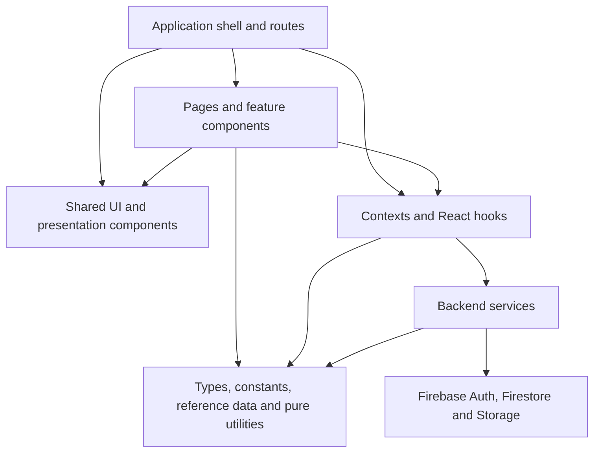

# Application architecture

## Purpose and scope

This document describes the application's current normalised architecture. It records the shared systems, their responsibilities, their dependency boundaries and the domain behaviour that deliberately remains local.

It covers:

- the application shell and shared presentation foundations;
- React contexts, hooks and state coordination;
- backend services and Firebase ownership;
- shared domain contracts, constants and canonical reference data;
- pure validation, formatting and calculation utilities;
- the rules used to decide whether code should be shared or remain feature-owned.

This is a current-state technical reference. It is not a change log, project history, deployment runbook or list of previous work.

Significant decisions that preserve intentional variation are documented separately in the [architecture decision records](./adr/README.md).

## System overview

The dependency direction is intentional:

1. Pages and feature components compose presentation and initiate user actions.
2. Shared UI components provide reusable interaction and visual contracts without owning domain persistence.
3. Contexts and hooks coordinate React state, subscriptions and service calls.
4. Services own backend reads, writes, transactions, batches and storage operations.
5. Types, constants, canonical data and pure utilities may support any higher layer but do not depend on React.

Generic modules must not import feature components. Feature modules may compose shared foundations, but a neutral consumer must not depend on a weapon, armour or other category module merely to reuse generic behaviour.

## Architectural principles

- Share a system only when its consumers have the same meaning, state transitions, validation and accessibility contract.
- Keep domain data, category-specific composition and genuinely different workflows local.
- Prefer small composable foundations to configurable components controlled by category switches or unrelated optional props.
- Keep backend operations in `src/services`, subscription coordination in hooks and presentation decisions in components.
- Keep pure calculations and transformations free of React and backend side effects.
- Use shared TypeScript contracts at boundaries between components, hooks, services and stored data.
- Treat focused tests, TypeScript, linting, production builds and structural accessibility checks as complementary enforcement.

## Presentation layer

### Application shell and navigation

`App` composes the global providers, routing, header, drawers, notifications and connectivity state.

The shared navigation system consists of:

- `AppHeader` for global actions and the current route;
- `PageShell`, `Panel` and `SectionHeader` for page-level hierarchy;
- `SectionDrawer` for two-level character-sheet navigation;
- `HeaderExtensionProvider`, its contexts and its hooks for page-supplied header content;
- `ROUTES`, `ROUTE_PATTERNS` and `buildRoute` for canonical paths;
- `useInstallMode` for the persisted full/player application mode.

Page-specific menu entries and feature sub-screens remain with their owning pages. `MessageDrawer` and the anchored header menu remain separate from `SectionDrawer` because their positioning and navigation lifecycles differ.

### Notifications, loading and resilience

Transient application feedback uses one toast system:

- `ToastProvider` owns toast identity, lifetime and stacking;
- `useToast` exposes success, error, warning, information and copy feedback;
- `ToastContainer` and `ToastItem` own notification presentation;
- timing values live in `constants/ui.ts`.

`LoadingState` and `ErrorState` provide consistent inline asynchronous presentation. Domain-specific empty messages and recovery actions remain local because their cause and useful next action differ.

Global runtime presentation is owned by:

- `ErrorBoundary` for fatal render failures;
- `OfflineIndicator` for connectivity state;
- `SplashScreen` for initial loading;
- `pwaUpdateState` for the hand-off between pre-React service-worker registration and in-app update feedback.

### Buttons and action controls

`Button` provides the typed variants and sizes used by conventional actions. Shared classes in `buttonStyles.ts` cover specialised back, dismiss, expansion and compact removal treatment.

Related controls are:

- `CloseButton` and `CloseIcon` for dismiss actions;
- `TrashIcon` and `RemoveButton` for destructive or compact removal actions;
- `ExpandChevron` for disclosure state;
- `ConfirmInline` for compact confirmation flows.

Every reusable action control owns an explicit button type and an accessible naming contract. Rows, tabs, disclosure headers and state toggles may use native buttons when their complete semantic contract differs from a conventional action button.

### Dialogs, pickers and contextual information

`ModalShell` owns portal rendering, native-dialog presentation, accessible labelling, backdrop behaviour, body scroll locking and mobile visual-viewport positioning. `ModalHeader` provides the shared title and close treatment.

Picker workflows compose:

- `PickerModal` for the searchable dialog frame;
- `PickerBody` for the scrolling content area;
- `PickerRow` for selectable results;
- `PickerCustomAction` for domain actions beneath a result list;
- `ArrowLeft` and `ArrowRight` for back and forward navigation;
- `OptionPickerScreen` for simple string or value/label choices;
- `PickerField` for form fields that open a picker.

The shared picker layer owns interaction and accessibility. Queries, filters, option data, result mapping, progression between sub-screens and context-specific empty messages remain domain-owned.

`InfoModal` composes the modal foundation for rules, descriptions and longer reference explanations. Its title and trigger behaviour are shared; its content remains with the relevant domain.

### Segmented navigation and swipe

`SegmentedTabs`, `segmentedTabStyles` and `useSwipeableTabs` provide:

- tab and tab-panel roles;
- stable tab and panel identifiers;
- selected state and roving focus;
- Arrow, Home and End keyboard behaviour;
- horizontal swipe coordination on mobile.

Tab labels, colours, order and panel content remain local to each feature.

### Forms and field presentation

The neutral field system consists of:

- `fieldControlClass` for editable, read-only, invalid and resize states;
- `editableInputClass` and `editableTextareaClass` for common editable presentation;
- `FormField` for labelled text and textarea values;
- `CharacteristicField` for characteristic base values and advances;
- `RequiredFormLabel` for required labels and supporting text.

Custom-item forms compose:

- `CustomFormShell` for the modal body and scroll-position boundary;
- `CustomFormSection` for section hierarchy and spacing;
- `OriginSelector` for Custom and 2nd Ed provenance;
- `PickerField` for modal choice fields;
- `CustomFormFooter` for required-field guidance and cancel/save actions.

These components standardise structure without owning weapon, armour, implant, drug, consumable, gear or Archeotech fields. Category-specific values, validation and screen progression remain within their domains.

Assigned cost and rarity flows use `AssignedItemMetaFields`, `AssignedItemMetaScreen` and `useAssignedItemMeta`. Gear, Archeotech and Cybernetics share cost validation, rarity selection and reset behaviour while their parent picker controls whether rarity is required and what screen follows confirmation.

Malignancy and mutation flows use `RollModifierFields`, `getRoll1d10Modifiers` and `areRollModifierValuesValid` for the common labelled 1–10 modifier contract. Reference tables and result creation remain local.

### Sections, cards and compact metadata

Shared layout and typography are provided by:

- `PageShell`, `Panel` and `SectionHeader`;
- `uiSectionShell`, `uiSection`, `uiCell` and the shared text and heading tokens;
- `Chip` and `chipClassName`;
- `ItemMetaChips`;
- `StatChip`;
- `StatusBadge`.

Shared presentation mappings include:

- colour tokens in `colourTokens.ts`;
- craftsmanship options and styles in `craftsmanship.ts`;
- source, availability and characteristic mappings in `sourceStyles.ts`;
- neutral money and weight formatting.

The shared layer controls visual language and compact metadata treatment. Each category still decides which statistics are shown, their order and the internal composition of an item row or card.

### Numeric editing and inline confirmation

`QuantityControl` and `useQuantityEdit` own inventory quantity clamping and commit behaviour. `ConfirmInline` owns compact confirm/cancel presentation.

`Stepper` remains a separate control for bounded character tracks such as wounds, fate, insanity and corruption. Its bounds, danger state and prominent layout are not the same contract as an inventory quantity.

### Messaging and portraits

Player conversations and the GM inbox share:

- `MessageThread` for message rendering;
- `MessageInput` for composition and sending;
- `MessageDrawer` for the player-facing off-canvas conversation surface.

The GM inbox reuses the thread and input components inside page content. The drawer retains its own positioning and open/close lifecycle.

`PortraitUpload` provides shared preview, file selection, validation, upload state and error feedback for dashboard and campaign-character management. The surrounding layout and displayed portrait size remain local.

## React coordination layer

### Firestore subscriptions

`useDocumentSubscription` and `useQuerySubscription` provide the standard subscription contract:

- data, loading and error state;
- empty data when a source is disabled or its identifier is missing;
- loading restart when a source changes;
- snapshot cleanup;
- snapshot-error handling;
- stale-data and stale-callback protection.

Domain hooks retain their query construction and snapshot mapping. The shared lifecycle is used by campaign, archived-campaign, character, character-summary, session, thread, message, XP-proposal, claim-log, profile and custom-item subscriptions.

Live collection queries must also have an explicit upper bound. The central client-side values in `constants/firestoreLimits.ts` currently cap:

- active DM and player campaign results at 50 per role, and archived campaigns at 100;
- campaign rosters at 100 characters and a player's owned-character result at 20;
- session history at 200 records and the DM inbox at 100 thread summaries;
- the live message window at the latest 100 messages and claim history at the latest 50 entries;
- each custom-item query at 200 results.

These limits are cost and abuse circuit-breakers, not substitutes for write-time product limits. A screen that could legitimately outgrow its live window must add deliberate pagination before increasing a cap.

Write boundaries independently validate stored input sizes. Current limits are 100 characters for campaign and character names, 50 for a first name, 2,000 for a message, 4,000 each for a session summary and private notes, 100 attendees and 100,000 XP per session, and 750,000 bytes for a character import. UI `maxLength` and numeric constraints provide immediate feedback, while services repeat validation so callers cannot bypass it accidentally. Firestore rules mirror security-relevant limits.

Compound consumers remain explicit:

- `CampaignsProvider` coordinates the DM and member views of active campaigns;
- `useCampaignCustomItems` merges bounded, server-filtered category/status queries;
- `useCharacterData` coordinates the character and a bounded DM-only claim history.

Expensive listeners follow the visible UI lifecycle. `MessageDrawer` mounts its thread only while open, and Campaign Overview starts a character's claim-history listener only while the DM has that History dialog open. Campaign Overview derives the small name/owner summaries needed by sessions from its existing roster result instead of opening a second listener on the same character collection.

### Campaign state

`CampaignsProvider`, `CampaignsContext` and `useCampaignsContext` expose one combined active/archived campaign state to the application.

Campaign-specific hooks provide narrower contracts:

- `useCampaign`;
- `useArchivedCampaigns`;
- `useCampaignCharacters`;
- `useCampaignCustomItems`.

They share subscription semantics but retain the queries and domain mapping that explain their data.

`usePlayerCharacters` applies `userId == current user` in Firestore rather than downloading the entire campaign roster and filtering it in the browser. Custom-item picker queries likewise apply a requested category in Firestore. This reduces both disclosed data and billed document reads; security rules remain the authority for access control.

### Authentication, roles and permissions

`useAuth` owns the React-facing authentication state. `useDMOverride` and `useCharacterPermissions` derive effective identity, DM override and character edit rights for the character sheet.

Device and account coordination is separated into:

- `useDeviceLink` for subscribed link state;
- `useLinkDevice` for link/unlink interaction state;
- `deviceLinkService`, `identityService` and `userAccountService` for backend operations.

Frontend permissions control presentation and attempted actions. Firestore security rules remain authoritative for backend access.

### Custom-item lifecycle

`useCustomItemLibraryActions`, the shared custom-item action types and `CustomItemActionButtons` provide one lifecycle for Gear, Consumables, Drugs, Cybernetics, Armour, Weapons, Archeotech and campaign administration.

The shared contract owns:

- active item/action busy state;
- duplicate-action prevention;
- publish, archive and update-all coordination;
- success and error feedback;
- busy-state cleanup.

`customItemService` owns persistence. Restore and permanent deletion remain campaign-administration operations, while category names, edit-form transitions and item presentation remain local.

### Character-sheet coordination

`useCharacterSheet` composes the character data, permissions and update contracts supplied to character-sheet tabs.

Supporting hooks separate recurring concerns:

- `useCharacterHelpers` for derived characteristic and movement values;
- `useCharacterMutations` for Firestore-safe character updates;
- `useCharacterPermissions` for editing and override rules;
- `usePsychicPowers` for psychic-power coordination;
- `useQuantityEdit` for inventory quantity edits.

Feature-specific picker and form state remains inside the owning tab.

### Skill pipeline

The Skills tab uses one pipeline:

1. `normaliseSkills` converts supported stored shapes into `SkillEntry` values.
2. `useSkillComputation` derives totals and training state.
3. `filterSkills` and `useSkillFiltering` apply the selected filters.
4. `useSkillSorting` orders the resulting skills.
5. `useSkillGroupCollapse` owns collapsed group state.

This keeps conversion, calculation, filtering and ordering independent from `SkillRow` presentation.

### Sessions, XP and messaging

`useSessions` exposes subscribed session state and service-backed mutations. `useXpProposals` exposes proposal state while `xpService` owns proposal, approval and rejection writes.

`useThreads` and `useThreadMessages` provide bounded subscribed messaging state. Thread selection and drawer visibility remain local presentation state, and closing the player drawer tears down its message listener.

The DM inbox only resets an unread counter when that counter is non-zero. User-account synchronisation creates a missing account document but performs no recurring `lastSeen` heartbeat write for an existing account. Both decisions remove automatic writes that had no necessary product outcome.

## Service and persistence layer

### Firebase ownership

`src/firebase.ts` initialises and exports the shared Firebase Auth, Firestore and Storage clients. Firestore uses persistent local caching with multi-tab coordination.

`firebase/converters.ts` owns the stable character, campaign and user converters and their typed document or collection reference helpers.

Services and subscription hooks reuse these references where they make the stored shape and path clearer. One-off domain queries may remain local when an extracted helper would obscure the query.

### Firestore security boundary

Firestore rules are the authoritative boundary for client access. In addition to ownership checks, current rules validate the permitted keys, primitive types and relevant size limits for user accounts, campaign metadata, recovery records, device-link records, sessions, message-thread summaries and individual messages. Client validation improves feedback but does not replace these checks.

Recovery lookup is intentionally transitional. Authenticated clients may fetch one exact `recoveryIndex/{code}` document so the current claim flow remains usable, but collection listing and filtered queries are denied. [ADR 0008](./adr/0008-keep-exact-recovery-lookup-temporarily.md) records this boundary until Stage 3 moves lookup behind HMAC-derived server-side identifiers.

Message owners may update a thread summary only through the send-message state transition: the last message and timestamp change and the unread count rises by exactly one. A DM may reply or reset the unread count. Linked devices may identify the effective primary account, while unrelated sender identities are rejected.

### Bounded bulk operations

Client-side bulk work reads documents in stable document-ID pages of 100 and commits each independent page separately. Message clearing, campaign child cleanup, custom-item version deletion and propagation across character copies use this shared boundary. Campaign deletion removes children before the campaign document and can be safely restarted after an interruption; already-removed documents are harmless on a retry.

Operations that must preserve one atomic ownership or audit boundary fail closed before staging writes if they cannot remain safely below Firestore's 500-write batch ceiling:

- character deletion accepts at most 440 combined claim-log and XP-proposal documents, leaving room for its thread, recovery-index and character documents;
- identity reclaim reads at most 50 DM campaigns, 50 member campaigns and 20 owned characters per member campaign, then permits at most 440 ownership writes in total;
- exceeding a ceiling produces a protected-operation error, performs no ownership migration, and leaves the larger resumable workflow to the protected bulk-job design in Stage 3.

These ceilings are safety boundaries rather than product entitlements. They prevent a browser from issuing an unbounded read or constructing an invalid oversized batch while preserving retryable normal operations.

### Firebase deployment configuration

`firebase.json` binds both `firestore.rules` and `firestore.indexes.json` so reviewed rules and index definitions are deployed from the same configuration. The index file includes the active/archived campaign lookups, collection-group character ownership lookup and category-filtered custom-item lookups used by the application.

Hosting responses are configured with a restrictive Content Security Policy, clickjacking protection, MIME sniffing protection, a no-referrer policy, disabled camera/geolocation/microphone permissions and same-origin isolation headers. HTML, service-worker and manifest files retain revalidation-oriented caching, while hashed assets remain immutable. These are repository settings only until an approved deployment; deployed-header verification belongs to the deployment checks and restore/test stage.

### Service responsibilities

| Service                 | Responsibility                                                                                                   |
| ----------------------- | ---------------------------------------------------------------------------------------------------------------- |
| `campaignService`       | Create, rename, archive, restore and delete campaigns                                                            |
| `characterService`      | Load, save, create, import, claim, release, assign and delete characters                                         |
| `customItemService`     | Create, save, publish, archive, restore and delete custom-item definitions and update or remove character copies |
| `deviceLinkService`     | Link and unlink devices and manage link proof                                                                    |
| `identityService`       | Register, reclaim, rotate and clear recovery identities                                                          |
| `messageService`        | Send messages, mark threads read and clear threads                                                               |
| `portraitService`       | Validate and upload portraits and persist portrait references                                                    |
| `profileService`        | Read and update user profile names                                                                               |
| `recoveryLookupService` | Resolve recovery lookups into typed outcomes                                                                     |
| `sessionService`        | Create, update and delete sessions and apply session XP                                                          |
| `userAccountService`    | Synchronise account state, track recovery backup and complete onboarding                                         |
| `xpService`             | Propose, approve and reject XP expenditure                                                                       |

Services throw useful errors. Hooks and components decide how those errors are presented. A failure must not be logged or translated repeatedly at several layers.

Actual backend reads, writes, transactions and batches belong in services. Subscription query construction may remain in hooks because it is part of the subscribed React contract, not an imperative backend operation.

## Domain contracts and pure foundations

### Shared types

`src/types` contains the shared campaign, character, claim-log, custom-item, recovery, skill-source, Firestore and user contracts.

These types define the boundaries between:

- Firestore converters and stored documents;
- services and their callers;
- subscription hooks and components;
- category implementations and custom-item lifecycle actions.

Small props used by only one component remain beside that component.

### Constants

Neutral values with the same meaning across features have one source:

- standard and extended availability options in `constants/availability.ts`;
- custom-item origins, category order, labels and status order in `constants/customItems.ts`;
- armour location order and labels in `constants/locations.ts`;
- characteristic, movement, skill, wounds and fate rules in `constants/gameRules.ts`;
- route definitions in `constants/routes.ts`;
- bounded Firestore read windows in `constants/firestoreLimits.ts`;
- stored-input and import ceilings in `constants/productLimits.ts`;
- toast, search and recovery-code timing or formatting values in `constants/ui.ts`;
- craftsmanship options and mappings in `ui/craftsmanship.ts`.

Feature-only choices remain local until another consumer requires the same meaning and allowed values.

### Canonical game data

`src/data` is the canonical source for book metadata, homeworlds, default skills, skill groups and descriptions, talents, traits and weapon training.

`src/data/reference` contains the canonical armour, weapon, ammunition, weapon-upgrade, special-rule, gear, consumable, drug, cybernetic, psychic and Archeotech records.

Pickers, forms, cards and calculations derive their views from these records. Campaign-created custom items and user-entered descriptions remain Firestore data.

### Validation and calculations

Shared game calculations and validation are pure:

- `utils/stats.ts` calculates characteristic totals;
- `utils/validation.ts` validates numeric ranges, characteristic values, wounds, fate, names and recovery codes;
- `utils/formInput.ts` sanitises non-negative integers, positive integers and dice expressions;
- `utils/skillUtils.ts` normalises stored skills;
- `utils/skillFilters.ts` applies pure skill filters;
- `utils/weaponUtils.ts` identifies integrated weapons and applies shared craftsmanship effects;
- `utils/armourLocations.ts` formats shared armour-location labels;
- `utils/customItemMeta.ts` detects variable cost or rarity metadata;
- `utils/claimLog.ts` builds and validates claim-log entries.

Weapon damage and quality formatting remains in the weapon domain because it is not generic form input. Category-specific game rules remain local until they have another consumer with the identical contract.

### Formatting, identifiers and data hygiene

Shared pure support includes:

- `moneyFormat.ts` and `weightFormat.ts` for entry and display formatting;
- `createLocalId(prefix)` for traumas, disorders, mutations and malignancies;
- `stripUndefined` for Firestore-safe object updates;
- `createEmptyCharacterData` for consistent new-character defaults;
- `exportCharacterJson` for character export;
- recovery-code generation and formatting utilities.

Firestore document IDs and externally defined reference IDs retain their own identity systems. Migration scripts are deliberate operational tools and are not part of normal application execution.

## Intentional local ownership

Normalisation stops where contracts genuinely diverge. The following remain local by design:

- tinted Archeotech card composition;
- drawer and anchored-menu positioning or navigation behaviour;
- `Stepper` versus `QuantityControl`;
- domain-specific form fields, option lists, validation and screen order;
- context-specific empty messages and recovery actions;
- category-specific item-card composition;
- specialised native row, tab, disclosure and toggle buttons.

These systems still reuse shared primitives below the point where their behaviour diverges. The rationale, consequences and revisit conditions are documented in the [architecture decision records](./adr/README.md).

## Enforcement

When adding or reviewing code:

1. Check this document and the existing modules in `src/ui`, `src/components`, `src/constants`, `src/context`, `src/hooks`, `src/services` and `src/utils` before creating a new foundation.
2. Reuse a shared system only when the complete behavioural, validation and accessibility contract matches.
3. Keep domain mapping and category composition visible in the domain module.
4. Do not import generic helpers from a feature directory.
5. Keep imperative backend operations in services and subscription lifecycle in the shared subscription hooks.
6. Keep utilities pure and independent of React or Firebase side effects.
7. Update shared TypeScript contracts when a boundary changes.
8. Add or update focused tests for changed contracts, then run TypeScript, lint and the production build.
9. Re-run structural checks for button semantics, dialog titles, accessible names and cross-feature imports when shared UI changes.
10. Record a new architecture decision only when intentional variation needs a durable rationale and a clear revisit condition.
