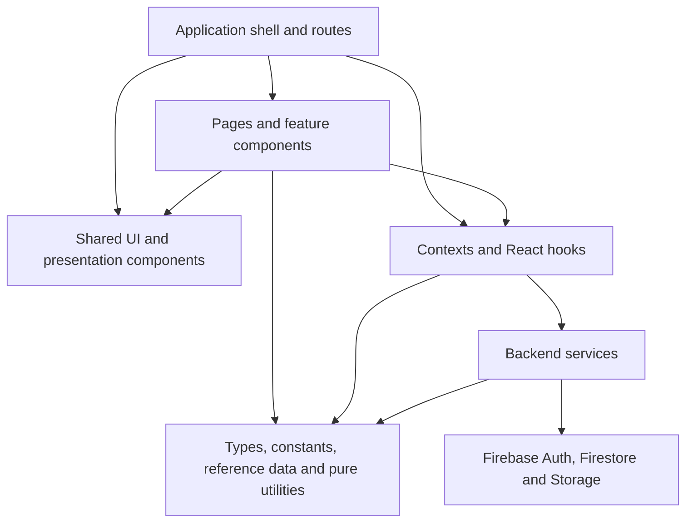

# Application architecture

## Purpose and scope

This document describes the application's current normalised architecture. It records the shared systems, their responsibilities, their dependency boundaries and the domain behaviour that deliberately remains local.

It covers:

- the application shell and shared presentation foundations;
- React contexts, hooks and state coordination;
- backend services and Firebase ownership;
- shared domain contracts, constants and canonical reference data;
- pure validation, formatting and calculation utilities;
- the rules used to decide whether code should be shared or remain feature-owned.

This is a current-state technical reference. It is not a change log, project history, deployment runbook or list of previous work.

Significant decisions that preserve intentional variation are documented separately in the [architecture decision records](./adr/README.md).

## System overview

The dependency direction is intentional:

1. Pages and feature components compose presentation and initiate user actions.
2. Shared UI components provide reusable interaction and visual contracts without owning domain persistence.
3. Contexts and hooks coordinate React state, subscriptions and service calls.
4. Services own backend reads, writes, transactions, batches and storage operations.
5. Types, constants, canonical data and pure utilities may support any higher layer but do not depend on React.

Generic modules must not import feature components. Feature modules may compose shared foundations, but a neutral consumer must not depend on a weapon, armour or other category module merely to reuse generic behaviour.

## Architectural principles

- Share a system only when its consumers have the same meaning, state transitions, validation and accessibility contract.
- Keep domain data, category-specific composition and genuinely different workflows local.
- Prefer small composable foundations to configurable components controlled by category switches or unrelated optional props.
- Keep backend operations in `src/services`, subscription coordination in hooks and presentation decisions in components.
- Keep pure calculations and transformations free of React and backend side effects.
- Use shared TypeScript contracts at boundaries between components, hooks, services and stored data.
- Treat focused tests, TypeScript, linting, production builds and structural accessibility checks as complementary enforcement.

## Presentation layer

### Application shell and navigation

`App` composes the global providers, routing, header, drawers, notifications and connectivity state.

The shared navigation system consists of:

- `AppHeader` for global actions and the current route;
- `PageShell`, `Panel` and `SectionHeader` for page-level hierarchy;
- `SectionDrawer` for two-level character-sheet navigation;
- `HeaderExtensionProvider`, its contexts and its hooks for page-supplied header content;
- `ROUTES`, `ROUTE_PATTERNS` and `buildRoute` for canonical paths;
- `useInstallMode` for the persisted full/player application mode.

Page-specific menu entries and feature sub-screens remain with their owning pages. `MessageDrawer` and the anchored header menu remain separate from `SectionDrawer` because their positioning and navigation lifecycles differ.

### Notifications, loading and resilience

Transient application feedback uses one toast system:

- `ToastProvider` owns toast identity, lifetime and stacking;
- `useToast` exposes success, error, warning, information and copy feedback;
- `ToastContainer` and `ToastItem` own notification presentation;
- timing values live in `constants/ui.ts`.

`LoadingState` and `ErrorState` provide consistent inline asynchronous presentation. Domain-specific empty messages and recovery actions remain local because their cause and useful next action differ.

Global runtime presentation is owned by:

- `ErrorBoundary` for fatal render failures;
- `OfflineIndicator` for connectivity state;
- `SplashScreen` for initial loading;
- `pwaUpdateState` for the hand-off between pre-React service-worker registration and in-app update feedback.

### Buttons and action controls

`Button` provides the typed variants and sizes used by conventional actions. Shared classes in `buttonStyles.ts` cover specialised back, dismiss, expansion and compact removal treatment.

Related controls are:

- `CloseButton` and `CloseIcon` for dismiss actions;
- `TrashIcon` and `RemoveButton` for destructive or compact removal actions;
- `ExpandChevron` for disclosure state;
- `ConfirmInline` for compact confirmation flows.

Every reusable action control owns an explicit button type and an accessible naming contract. Rows, tabs, disclosure headers and state toggles may use native buttons when their complete semantic contract differs from a conventional action button.

### Dialogs, pickers and contextual information

`ModalShell` owns portal rendering, native-dialog presentation, accessible labelling, backdrop behaviour, body scroll locking and mobile visual-viewport positioning. `ModalHeader` provides the shared title and close treatment.

Picker workflows compose:

- `PickerModal` for the searchable dialog frame;
- `PickerBody` for the scrolling content area;
- `PickerRow` for selectable results;
- `PickerCustomAction` for domain actions beneath a result list;
- `ArrowLeft` and `ArrowRight` for back and forward navigation;
- `OptionPickerScreen` for simple string or value/label choices;
- `PickerField` for form fields that open a picker.

The shared picker layer owns interaction and accessibility. Queries, filters, option data, result mapping, progression between sub-screens and context-specific empty messages remain domain-owned.

`InfoModal` composes the modal foundation for rules, descriptions and longer reference explanations. Its title and trigger behaviour are shared; its content remains with the relevant domain.

### Segmented navigation and swipe

`SegmentedTabs`, `segmentedTabStyles` and `useSwipeableTabs` provide:

- tab and tab-panel roles;
- stable tab and panel identifiers;
- selected state and roving focus;
- Arrow, Home and End keyboard behaviour;
- horizontal swipe coordination on mobile.

Tab labels, colours, order and panel content remain local to each feature.

### Forms and field presentation

The neutral field system consists of:

- `fieldControlClass` for editable, read-only, invalid and resize states;
- `editableInputClass` and `editableTextareaClass` for common editable presentation;
- `FormField` for labelled text and textarea values;
- `CharacteristicField` for characteristic base values and advances;
- `RequiredFormLabel` for required labels and supporting text.

Custom-item forms compose:

- `CustomFormShell` for the modal body and scroll-position boundary;
- `CustomFormSection` for section hierarchy and spacing;
- `OriginSelector` for Custom and 2nd Ed provenance;
- `PickerField` for modal choice fields;
- `CustomFormFooter` for required-field guidance and cancel/save actions.

These components standardise structure without owning weapon, armour, implant, drug, consumable, gear or Archeotech fields. Category-specific values, validation and screen progression remain within their domains.

Assigned cost and rarity flows use `AssignedItemMetaFields`, `AssignedItemMetaScreen` and `useAssignedItemMeta`. Gear, Archeotech and Cybernetics share cost validation, rarity selection and reset behaviour while their parent picker controls whether rarity is required and what screen follows confirmation.

Malignancy and mutation flows use `RollModifierFields`, `getRoll1d10Modifiers` and `areRollModifierValuesValid` for the common labelled 1–10 modifier contract. Reference tables and result creation remain local.

### Sections, cards and compact metadata

Shared layout and typography are provided by:

- `PageShell`, `Panel` and `SectionHeader`;
- `uiSectionShell`, `uiSection`, `uiCell` and the shared text and heading tokens;
- `Chip` and `chipClassName`;
- `ItemMetaChips`;
- `StatChip`;
- `StatusBadge`.

Shared presentation mappings include:

- colour tokens in `colourTokens.ts`;
- craftsmanship options and styles in `craftsmanship.ts`;
- source, availability and characteristic mappings in `sourceStyles.ts`;
- neutral money and weight formatting.

The shared layer controls visual language and compact metadata treatment. Each category still decides which statistics are shown, their order and the internal composition of an item row or card.

### Numeric editing and inline confirmation

`QuantityControl` and `useQuantityEdit` own inventory quantity clamping and commit behaviour. `ConfirmInline` owns compact confirm/cancel presentation.

`Stepper` remains a separate control for bounded character tracks such as wounds, fate, insanity and corruption. Its bounds, danger state and prominent layout are not the same contract as an inventory quantity.

### Messaging and portraits

Player conversations and the GM inbox share:

- `MessageThread` for message rendering;
- `MessageInput` for composition and sending;
- `MessageDrawer` for the player-facing off-canvas conversation surface.

The GM inbox reuses the thread and input components inside page content. The drawer retains its own positioning and open/close lifecycle.

`PortraitUpload` provides shared preview, file selection, validation, upload state and error feedback for dashboard and campaign-character management. The surrounding layout and displayed portrait size remain local.

## React coordination layer

### Firestore subscriptions

`useDocumentSubscription` and `useQuerySubscription` provide the standard subscription contract:

- data, loading and error state;
- empty data when a source is disabled or its identifier is missing;
- loading restart when a source changes;
- snapshot cleanup;
- snapshot-error handling;
- stale-data and stale-callback protection.

Domain hooks retain their query construction and snapshot mapping. The shared lifecycle is used by campaign, archived-campaign, character, session, thread, message, claim-log, profile and custom-item subscriptions.

Live collection queries must also have an explicit upper bound. The central client-side values in `constants/firestoreLimits.ts` currently cap:

- active DM and player campaign results at 50 per role, and archived campaigns at 100;
- campaign rosters at 100 characters and a player's collection-group owned-character result at 1,000;
- session history at 200 records and the DM inbox at 100 thread summaries;
- the live message window and each explicitly requested older page at 100 messages, and claim history at the latest 50 entries;
- each custom-item query at 200 results.

These limits are cost and abuse circuit-breakers, not substitutes for write-time product limits. A screen that could legitimately outgrow its live window must add deliberate pagination before increasing a cap.

### Hard product limits

`constants/productLimits.ts` is the authoritative numerical policy for user-created data and costly operations. Stage 2 records the complete policy before adding its remaining rules, throttling and bulk-operation enforcement. A value appearing in this table therefore means “must be enforced by the end of the relevant Stage 2 section,” not that every layer already enforces it today.

| Area                      |                                                                                      Limit | Rationale                                                                                                                             |
| ------------------------- | -----------------------------------------------------------------------------------------: | ------------------------------------------------------------------------------------------------------------------------------------- |
| Campaign creation         |                                                           10 per user per rolling 24 hours | Allows setup and testing while stopping rapid document creation                                                                       |
| Campaign membership       |                                                                   100 members per campaign | Far above a normal Dark Heresy group while bounding arrays and fan-out                                                                |
| Campaign characters       |                                                                100 characters per campaign | Supports long-running campaigns and NPC rosters without unbounded collections                                                         |
| Campaign/character name   |                                                                             100 characters | Supports descriptive names without oversized indexed/display strings                                                                  |
| User first name           |                                                                              50 characters | Matches the deliberately minimal public profile contract                                                                              |
| Session attendance        |                                                                          100 character IDs | Bounds XP fan-out and the stored attendee array                                                                                       |
| Session XP                |                                                              100,000 whole XP per attendee | Permits exceptional awards while rejecting accidental extreme values                                                                  |
| Session summary/DM notes  |                                                                      4,000 characters each | Allows detailed notes while bounding document growth                                                                                  |
| Message body              |                                                                           2,000 characters | Supports normal conversation without large chat writes                                                                                |
| Thread preview            |                                                                             500 characters | Keeps frequently read inbox summaries small                                                                                           |
| Message history           |                                           5,000 retained per thread; 100 returned per page | Bounds long-term growth and every live/history read                                                                                   |
| Claim history             |                                                                       50 returned per page | Keeps the DM-only audit view bounded                                                                                                  |
| Legacy XP proposals       |                             Direct create and update disabled; cleanup reads capped at 440 | The current product has no XP-proposal workflow, so the obsolete write surface is closed while bounded deletion compatibility remains |
| Custom items              |                                                                           200 per campaign | Supports extensive homebrew libraries while matching the bounded library query                                                        |
| Custom-item versions      |                                                                                50 per item | Preserves useful history without unlimited version growth                                                                             |
| Custom-item content       | 100-character name; 4,000-character text; 100,000 encoded bytes; 100 entries/keys; depth 8 | Bounds user-controlled nested definitions independently of document limits                                                            |
| Character import/document |                                         750,000-byte import; 900,000-byte encoded document | Leaves safety headroom below Firestore's 1 MiB document limit                                                                         |
| Character collections     |                                        200 entries per array; 100 keys per object; depth 8 | Supports large inventories and histories while stopping structural amplification                                                      |
| Portrait                  |                                         5,000,000-byte source; 350,000-byte encoded output | Allows ordinary phone images while keeping the character document bounded                                                             |
| Recovery/link attempts    |                                                5 of each per device per rolling 15 minutes | Slows code guessing without blocking ordinary correction of typing mistakes                                                           |
| Bulk operation            |                                                      440 affected documents per invocation | Leaves explicit headroom below Firestore's 500-write batch ceiling                                                                    |

Limits use decimal bytes because browser `File.size`, encoded strings and Firestore document budgeting are compared as byte counts rather than marketed storage units. Rate and attempt windows are rolling windows. Server-authoritative enforcement that cannot be made abuse-resistant on Spark remains explicitly identified for Stage 3; Stage 2 still applies the strongest safe local and rules-based containment available.

UI constraints provide immediate feedback, services reject invalid work before contacting Firebase, and Firestore rules mirror every security-relevant limit they can evaluate. None of those layers substitutes for another.

### Client validation boundary

`utils/firebaseValidation.ts` provides the shared request-boundary checks used by Firebase-facing services and import or upload entry points. Character imports are size-checked before their text is read, parsed only after that check, and then restricted to the exact supported top-level structure, required fields, field types and bounded nested data. Imported timestamps and IDs are not trusted, and the service issues the new character's own ID, timestamps and recovery code.

Portraits accept only JPEG, PNG or WebP input, reject an oversized source before it is read, and reject an oversized encoded data URL before the character document is written. Messages and thread previews, session values and attendees, campaign and character names, custom-item fields and nested content, character arrays and maps, recovery-code syntax, Firestore document IDs, and client bulk counts are likewise checked before their Firebase operation begins. Service checks cover callers that bypass a particular form, while form constraints provide earlier feedback where practical.

These checks are usability and cost-control measures. They reduce accidental reads, writes and oversized payloads, but they are not a security boundary: a modified client can bypass them, so Firestore rules and the later protected backend remain authoritative.

### Duplicate-submission boundary

`utils/singleFlight.ts` keeps an in-memory promise for each mutation scope and operation identity. If the same campaign, character, session, ownership, custom-item, recovery or device-link operation is submitted again before the first promise settles, every caller receives the first operation's result and only one Firebase request sequence runs. The entry is removed after either success or failure so an intentional retry remains possible.

Campaign creation and renaming include their submitted names in the operation identity. Character and session edits include their validated payloads, so an identical repeated update is collapsed without discarding a different update made while the first is pending. Destructive and security-sensitive actions use their stable target IDs. Portrait uploads allow one pending write per character. Custom-item publish and propagation actions retain their existing synchronous per-item UI guard and also use the shared service boundary.

Buttons and forms continue to expose busy states, and synchronous refs close the same-render click gap for shared confirmations, campaign and character creation, imports, session actions, recovery screens and device linking. These protections exist within one running client only. They cannot deduplicate retries from another tab, device, process or modified client; Stage 3 therefore adds server-side idempotency for expensive and security-sensitive operations.

Compound consumers remain explicit:

- `CampaignsProvider` coordinates the DM and member views of active campaigns;
- `useCampaignCustomItems` merges bounded, server-filtered category/status queries and accepts a small category set so a multi-category tab does not open duplicate subscriptions;
- `useCharacterData` subscribes only to the character document; claim history has its own deliberately enabled hook.

Expensive listeners follow the visible UI lifecycle. `MessageDrawer` mounts its thread only while open, DM Inbox mounts messages only for the expanded thread, and both Campaign Overview and the character-sheet Admin tab start claim history only while the DM has explicitly opened History. Campaign Overview derives the small name/owner summaries needed by sessions from its existing bounded roster result instead of opening a second listener on the same character collection; the obsolete full-character summary hook has been removed.

### Campaign state

`CampaignsProvider`, `CampaignsContext` and `useCampaignsContext` expose one combined active/archived campaign state to the application.

Campaign-specific hooks provide narrower contracts:

- `useCampaign`;
- `useArchivedCampaigns`;
- `useCampaignCharacters`;
- `useCampaignCustomItems`.

They share subscription semantics but retain the queries and domain mapping that explain their data.

`usePlayerCharacters` uses the indexed `characters` collection group and applies `userId == current user` in Firestore. Dashboard therefore opens one bounded ownership listener for the user, groups only those authorised results by their stored campaign ID, and never downloads another player's campaign characters. Custom-item picker queries likewise apply one category or a small `in` category set in Firestore. This reduces both disclosed data and billed document reads; security rules remain the authority for access control.

### Authentication, roles and permissions

`useAuth` owns the React-facing authentication state. `useDMOverride` and `useCharacterPermissions` derive effective identity, DM override and character edit rights for the character sheet.

Device and account coordination is separated into:

- `useDeviceLink` for subscribed link state;
- `useLinkDevice` for link/unlink interaction state;
- `deviceLinkService`, `identityService` and `userAccountService` for backend operations.

Frontend permissions control presentation and attempted actions. Firestore security rules remain authoritative for backend access.

### Custom-item lifecycle

`useCustomItemLibraryActions`, the shared custom-item action types and `CustomItemActionButtons` provide one lifecycle for Gear, Consumables, Drugs, Cybernetics, Armour, Weapons, Archeotech and campaign administration.

The shared contract owns:

- active item/action busy state;
- duplicate-action prevention;
- publish, archive and update-all coordination;
- success and error feedback;
- busy-state cleanup.

`customItemService` owns persistence. Restore and permanent deletion remain campaign-administration operations, while category names, edit-form transitions and item presentation remain local.

### Character-sheet coordination

`useCharacterSheet` composes the character data, permissions and update contracts supplied to character-sheet tabs.

Supporting hooks separate recurring concerns:

- `useCharacterHelpers` for derived characteristic and movement values;
- `useCharacterMutations` for Firestore-safe character updates;
- `useCharacterPermissions` for editing and override rules;
- `usePsychicPowers` for psychic-power coordination;
- `useQuantityEdit` for inventory quantity edits.

Feature-specific picker and form state remains inside the owning tab.

### Skill pipeline

The Skills tab uses one pipeline:

1. `normaliseSkills` converts supported stored shapes into `SkillEntry` values.
2. `useSkillComputation` derives totals and training state.
3. `filterSkills` and `useSkillFiltering` apply the selected filters.
4. `useSkillSorting` orders the resulting skills.
5. `useSkillGroupCollapse` owns collapsed group state.

This keeps conversion, calculation, filtering and ordering independent from `SkillRow` presentation.

### Sessions, XP and messaging

`useSessions` exposes subscribed session state and service-backed mutations. There is no current XP-proposal UI, hook or service. The legacy `xpProposals` path remains readable only to the campaign DM or character owner through a bounded query, and direct create/update writes are denied until a real workflow is designed behind an appropriate protected boundary.

`useThreads` provides a bounded thread-summary subscription. `useThreadMessages` keeps only the latest 100 messages live, ordered by timestamp and document ID for a stable cursor; pressing Load older messages performs a bounded one-shot read for the preceding page and merges it without duplicates. Thread expansion and drawer visibility remain local presentation state, closing the player drawer tears down its message listener, and prepending history does not trigger the new-message auto-scroll.

The DM inbox only resets an unread counter when that counter is non-zero. The count is passed into the service, which also returns before constructing a Firestore write when it is already zero. User-account synchronisation creates a missing account document with one `setDoc` call but performs no follow-up update and no recurring `lastSeen` heartbeat write for an existing account.

Long-form live character text is held as a local draft and written after a 600 ms pause; blur and unmount flush the final draft. Height and weight are committed on blur or Enter rather than on every valid intermediate keystroke. Discrete controls and explicit Save/Confirm actions remain immediate because delaying them would add failure and navigation ambiguity for little cost benefit.

`experience.spent` remains a stored derived value for inexpensive display and rules checks. A local equality check avoids a Firestore transaction in the normal case. If stale data is observed, `characterService` recomputes from a fresh transaction snapshot and updates only `experience.spent`. Firestore retries a transaction after a concurrent edit, so two tabs converge after one committed correction without overwriting the rest of the `experience` object.

### Remaining automatic Firestore writes

Every write that can start without a dedicated Save, Confirm or action-button press is listed here:

| Trigger                                                               | Stored write                                             | Suppression                                                                                                                                                  | Why it remains justified                                                                                                                              |
| --------------------------------------------------------------------- | -------------------------------------------------------- | ------------------------------------------------------------------------------------------------------------------------------------------------------------ | ----------------------------------------------------------------------------------------------------------------------------------------------------- |
| First authenticated launch with no `users/{uid}` document             | Create the user document once with onboarding incomplete | Existing users are read-only at startup; there is no `lastSeen` write and no second creation update                                                          | The durable account record is required to route a genuinely new user through recovery setup                                                           |
| DM opens a thread whose observed `unreadForDM` is above zero          | Reset `unreadForDM` to zero                              | Both the inbox and service skip zero; subsequent snapshots therefore settle without another write                                                            | Clearing a visible unread badge is necessary message state and attributable to opening that conversation                                              |
| An editable character snapshot has a stale derived `experience.spent` | Transactionally update only `experience.spent`           | Local equality check avoids normal reads; the transaction rechecks current data and writes only when still stale; same-tab calls share one in-flight promise | Repairing legacy or interrupted XP state preserves correct remaining-XP and rank behaviour, and concurrency produces at most one committed correction |

Subscriptions, route effects, offline indicators, recovery-backup checks and onboarding code rehydration are read-only. Recovery-code generation, backup confirmation, messages, sessions, ownership changes, custom-item propagation, portraits and ordinary character edits all require an explicit user action and are therefore not automatic writes.

## Service and persistence layer

### Firebase ownership

`src/firebase.ts` initialises and exports the shared Firebase Auth, Firestore and Storage clients. Firestore uses persistent local caching with multi-tab coordination.

`firebase/converters.ts` owns the stable character, campaign and user converters and their typed document or collection reference helpers.

Services and subscription hooks reuse these references where they make the stored shape and path clearer. One-off domain queries may remain local when an extracted helper would obscure the query.

### Firestore security boundary

Firestore rules are the authoritative boundary for client access. In addition to ownership checks, current rules reject unexpected document fields and validate the stored shape, primitive types and relevant size limits for user accounts, public profiles, campaign metadata, characters, custom items and versions, recovery records, device-link records, sessions, claim logs, message-thread summaries and individual messages. Identity recovery, reclaim, secret and link-proof documents also require exact `DH-XXXX-XXXX` codes and bounded identity fields. Deep polymorphic character and custom-item content is additionally checked by the exact client validator because Firestore's 1,000-expression evaluation ceiling prevents recursively reproducing the complete TypeScript schema in one rule evaluation; the rules still enforce exact top-level document fields, critical nested discriminators, collection sizes and Firestore's own document-size ceiling. Client validation improves feedback but does not replace the rule boundary.

Recovery lookup is intentionally transitional. Authenticated clients may fetch one exact `recoveryIndex/{code}` document so the current claim flow remains usable, but collection listing and filtered queries are denied. A character can be created only when the same atomic write creates the matching index record. An index record must use the exact Recovery Code format and point to a character storing that same code; it cannot be repointed, and it can be deleted only when the indexed character is deleted in the same atomic operation. [ADR 0008](./adr/0008-keep-exact-recovery-lookup-temporarily.md) records this boundary until Stage 3 moves lookup behind HMAC-derived server-side identifiers.

Message owners may update a thread summary only through the send-message state transition: the last message and timestamp change and the unread count rises by exactly one. A DM summary write must be one of three shapes: a reply changing only preview/timestamp, a non-zero unread count changing to zero, or a clear operation producing an empty preview/timestamp and zero unread count. Preview text is capped at 500 characters. Linked devices may identify the effective primary account, while unrelated sender identities are rejected.

Claim-log documents are exact-schema, append-only audit records. A create is allowed only when `getAfter()` observes the matching character ownership transition in the same atomic operation; a plausible-looking standalone log therefore fails. Log deletion is allowed only as part of deletion of the parent character. The broad direct claim and campaign-membership transitions remain temporarily available for the existing claim interface and are replaced by the protected Stage 3 operation.

Custom-item drafts may be created only by the campaign DM or a user present in the campaign membership array, with linked devices acting as their primary identity. Item and version documents have exact top-level schemas, bounded names, text, maps, arrays and version numbers. Only the DM may publish, archive, restore or permanently remove library definitions.

Firestore list operations must carry a compatible explicit limit. Current rule ceilings are 100 campaigns, 100 characters in one campaign, 1,000 owned characters through the collection group, 200 sessions, 100 thread summaries, 100 messages, 200 custom items, 100 versions, and 440 claim-log or legacy XP-proposal records for protected cleanup compatibility. Public user profiles and both Recovery Index collections are exact-document lookup surfaces and cannot be listed.

### Bounded bulk operations

Client-side destructive work first reads only enough stable document-ID pages to calculate an exact safe impact or prove that the operation is too large. Campaign deletion, character deletion and permanent custom-item deletion proceed only when every known target fits in one atomic batch of at most 440 writes. The confirmation interface shows the document count. A missing Recovery Index key, a count above the ceiling or another incomplete deletion plan disables confirmation before the first write; no client-side multi-batch partial deletion is attempted. [ADR 0010](./adr/0010-preflight-client-wide-operations.md) records this temporary boundary until Stage 3 provides protected resumable bulk jobs.

Campaign-wide custom-item propagation and removal scan at most the product ceiling of 100 characters, calculate both affected character documents and linked copies, and commit all character mutations in one batch. Archive-and-remove includes the library item update in that same batch. Publishing a pending definition and updating copies remains a two-step retryable operation, but the complete read/write impact is preflighted before publication begins. A campaign already beyond the character ceiling is disabled for these client-wide operations until the protected backend path exists.

Session XP application and reversal count one session document plus one write per unique attendee. Attendees are bounded to 100 and the total is checked against the 440-document client ceiling before the transaction stages any write. The interface states this total before application or reversal.

Other operations that must preserve one atomic ownership or audit boundary also fail closed before staging writes if they cannot remain safely below Firestore's 500-write batch ceiling:

- identity reclaim reads at most 50 DM campaigns, 50 member campaigns and 20 owned characters per member campaign, then permits at most 440 ownership writes in total;
- exceeding a ceiling produces a protected-operation error, performs no ownership migration, and leaves the larger resumable workflow to the protected bulk-job design in Stage 3.

These ceilings are safety boundaries rather than product entitlements. They prevent a browser from issuing an unbounded read or constructing an invalid oversized batch while preserving retryable normal operations.

### Firebase deployment configuration

`firebase.json` binds both `firestore.rules` and `firestore.indexes.json` so a future approved Firebase deployment reads the reviewed rules and index definitions from the same configuration. No production deployment is performed merely by editing or testing these files.

The local index file is the reviewed production correction. Its complete non-automatic index inventory is:

| Query surface                            | Required index                                        | Reason                                                                                                                                |
| ---------------------------------------- | ----------------------------------------------------- | ------------------------------------------------------------------------------------------------------------------------------------- |
| Active and archived DM campaigns         | `campaigns`: `dmId ASC`, `archivedAt ASC`             | Combines DM equality with active equality or archived inequality                                                                      |
| Active player campaigns                  | `campaigns`: `memberIds CONTAINS`, `archivedAt ASC`   | Supports the Dashboard's membership `array-contains` query while excluding archived campaigns; this is the formerly missing composite |
| Published custom items by category       | `customItems`: `status ASC`, `category ASC`           | Combines publication status with one-category equality or multi-category `in` filtering                                               |
| Creator-visible custom items by category | `customItems`: `creator.userId ASC`, `category ASC`   | Combines creator ownership with the same category filters                                                                             |
| Player-owned characters across campaigns | `characters.userId ASC` with `COLLECTION_GROUP` scope | Supports the Dashboard ownership lookup across every campaign character subcollection                                                 |

All other current local queries use Firestore's automatic single-field indexes or document-ID ordering and do not need a composite definition. Unit tests lock this exact reviewed inventory and the `firebase.json` binding. Emulator tests separately exercise the player membership query and a collection-group ownership query spanning multiple campaigns. The emulator verifies query shape, results and rules; the configuration test is what proves the production composite is present because the emulator does not reliably reproduce production missing-index failures.

When deployment is separately approved, the prepared index-only correction is applied with `firebase deploy --only firestore:indexes` and then verified in the Firebase console before relying on the affected production queries. That command has not been run during this stage.

Hosting responses are configured with a restrictive Content Security Policy, clickjacking protection, MIME sniffing protection, a no-referrer policy, disabled camera/geolocation/microphone permissions and same-origin isolation headers. HTML, service-worker and manifest files retain revalidation-oriented caching, while hashed assets remain immutable. These are repository settings only until an approved deployment; deployed-header verification belongs to the deployment checks and restore/test stage.

### Local dependency and secret safety

`scripts/checkLocalSafety.mjs` is a deterministic, local-only deployment guard. It reads files inside the selected project directory and does not make network requests, invoke an external scanner or upload source, dependency data or matched values. Its output reports only the affected path and type of finding; secret values are never echoed.

The secret scope checks environment-file names and variable names, credential/private-key filenames and content markers, common provider-token shapes, Recovery Code-shaped values outside approved tests and documentation, and unsafe Vite environment exposure. Generated dependency, build, emulator and reference-image directories are excluded, while ordinary source, configuration, documentation, tests and local text artefacts remain covered. Recovery Codes in `tests/` and `docs/` are recognised as deliberate fixtures; production source is not exempt.

Only `VITE_FIREBASE_API_KEY` is approved as a public build-time setting. Firebase web configuration is sent to every browser by design and is protected by Authentication, App Check when introduced, and Firestore rules rather than by treating its API key as a server secret. The local `.env` remains ignored and the checker prints its approved variable name but never its value. Other environment variables are rejected because any `VITE_` value referenced by application code is embedded in the browser bundle.

The lockfile scope requires one npm version-3 `package-lock.json`, exact agreement between its root direct dependency maps and `package.json`, and a locked package entry for every direct production and development dependency. This detects local manifest/lock drift without contacting the npm registry; it is not a vulnerability-database audit.

The repeatable commands are:

- `npm run check:secrets` for secret, environment and browser-exposure checks;
- `npm run check:lockfile` for offline dependency consistency;
- `npm run check:safety` for both local scopes;
- `npm run check:deployment:local` for the safety checks followed by the production build and both existing automated test suites.

The safety gate currently fails closed because `serviceAccountKey.json` is still stored in the project folder and contains a service-account private key. The file is ignored and the guard leaves it untouched, but ignore rules do not remove the credential or prevent OneDrive synchronisation and local copies. Stage 4 replaces and revokes that credential, removes the JSON from the project workspace, and switches local administration to credentials held outside the repository; until then, a failed secret check is the intended safe result.

An online dependency-vulnerability audit is deliberately absent from the local gate. It may contact a package registry and disclose dependency metadata, so it requires separate network approval and must never be represented as part of an offline check. No source or secrets may be submitted to any external scanning service.

### Service responsibilities

| Service                 | Responsibility                                                                                                   |
| ----------------------- | ---------------------------------------------------------------------------------------------------------------- |
| `campaignService`       | Create, rename, archive, restore and delete campaigns                                                            |
| `characterService`      | Load, save, create, import, claim, release, assign and delete characters                                         |
| `customItemService`     | Create, save, publish, archive, restore and delete custom-item definitions and update or remove character copies |
| `deviceLinkService`     | Link and unlink devices and manage link proof                                                                    |
| `identityService`       | Register, reclaim, rotate and clear recovery identities                                                          |
| `messageService`        | Send messages, mark threads read and clear threads                                                               |
| `portraitService`       | Validate and upload portraits and persist portrait references                                                    |
| `profileService`        | Read and update user profile names                                                                               |
| `recoveryLookupService` | Resolve recovery lookups into typed outcomes                                                                     |
| `sessionService`        | Create, update and delete sessions and apply session XP                                                          |
| `userAccountService`    | Synchronise account state, track recovery backup and complete onboarding                                         |

Services throw useful errors. Hooks and components decide how those errors are presented. A failure must not be logged or translated repeatedly at several layers.

Actual backend reads, writes, transactions and batches belong in services. Subscription query construction may remain in hooks because it is part of the subscribed React contract, not an imperative backend operation.

## Domain contracts and pure foundations

### Shared types

`src/types` contains the shared campaign, character, claim-log, custom-item, recovery, skill-source, Firestore and user contracts.

These types define the boundaries between:

- Firestore converters and stored documents;
- services and their callers;
- subscription hooks and components;
- category implementations and custom-item lifecycle actions.

Small props used by only one component remain beside that component.

### Constants

Neutral values with the same meaning across features have one source:

- standard and extended availability options in `constants/availability.ts`;
- custom-item origins, category order, labels and status order in `constants/customItems.ts`;
- armour location order and labels in `constants/locations.ts`;
- characteristic, movement, skill, wounds and fate rules in `constants/gameRules.ts`;
- route definitions in `constants/routes.ts`;
- bounded Firestore read windows in `constants/firestoreLimits.ts`;
- stored-input and import ceilings in `constants/productLimits.ts`;
- toast, search and recovery-code timing or formatting values in `constants/ui.ts`;
- craftsmanship options and mappings in `ui/craftsmanship.ts`.

Feature-only choices remain local until another consumer requires the same meaning and allowed values.

### Canonical game data

`src/data` is the canonical source for book metadata, homeworlds, default skills, skill groups and descriptions, talents, traits and weapon training.

`src/data/reference` contains the canonical armour, weapon, ammunition, weapon-upgrade, special-rule, gear, consumable, drug, cybernetic, psychic and Archeotech records.

Pickers, forms, cards and calculations derive their views from these records. Campaign-created custom items and user-entered descriptions remain Firestore data.

### Validation and calculations

Shared game calculations and validation are pure:

- `utils/stats.ts` calculates characteristic totals;
- `utils/validation.ts` validates numeric ranges, characteristic values, wounds, fate, names and recovery codes;
- `utils/formInput.ts` sanitises non-negative integers, positive integers and dice expressions;
- `utils/skillUtils.ts` normalises stored skills;
- `utils/skillFilters.ts` applies pure skill filters;
- `utils/weaponUtils.ts` identifies integrated weapons and applies shared craftsmanship effects;
- `utils/armourLocations.ts` formats shared armour-location labels;
- `utils/customItemMeta.ts` detects variable cost or rarity metadata;
- `utils/claimLog.ts` builds and validates claim-log entries.

Weapon damage and quality formatting remains in the weapon domain because it is not generic form input. Category-specific game rules remain local until they have another consumer with the identical contract.

### Formatting, identifiers and data hygiene

Shared pure support includes:

- `moneyFormat.ts` and `weightFormat.ts` for entry and display formatting;
- `createLocalId(prefix)` for traumas, disorders, mutations and malignancies;
- `stripUndefined` for Firestore-safe object updates;
- `createEmptyCharacterData` for consistent new-character defaults;
- `exportCharacterJson` for character export;
- recovery-code generation and formatting utilities.

Firestore document IDs and externally defined reference IDs retain their own identity systems. Migration scripts are deliberate operational tools and are not part of normal application execution.

## Intentional local ownership

Normalisation stops where contracts genuinely diverge. The following remain local by design:

- tinted Archeotech card composition;
- drawer and anchored-menu positioning or navigation behaviour;
- `Stepper` versus `QuantityControl`;
- domain-specific form fields, option lists, validation and screen order;
- context-specific empty messages and recovery actions;
- category-specific item-card composition;
- specialised native row, tab, disclosure and toggle buttons.

These systems still reuse shared primitives below the point where their behaviour diverges. The rationale, consequences and revisit conditions are documented in the [architecture decision records](./adr/README.md).

## Enforcement

When adding or reviewing code:

1. Check this document and the existing modules in `src/ui`, `src/components`, `src/constants`, `src/context`, `src/hooks`, `src/services` and `src/utils` before creating a new foundation.
2. Reuse a shared system only when the complete behavioural, validation and accessibility contract matches.
3. Keep domain mapping and category composition visible in the domain module.
4. Do not import generic helpers from a feature directory.
5. Keep imperative backend operations in services and subscription lifecycle in the shared subscription hooks.
6. Keep utilities pure and independent of React or Firebase side effects.
7. Update shared TypeScript contracts when a boundary changes.
8. Add or update focused tests for changed contracts, then run TypeScript, lint and the production build.
9. Re-run structural checks for button semantics, dialog titles, accessible names and cross-feature imports when shared UI changes.
10. Record a new architecture decision only when intentional variation needs a durable rationale and a clear revisit condition.
