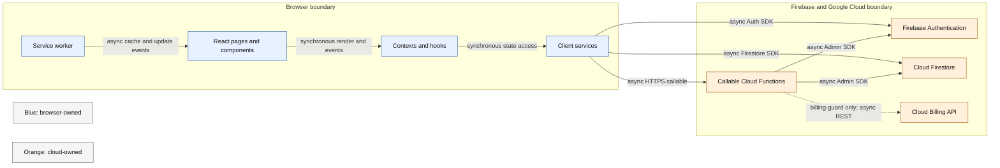

# Application architecture

Runtime boundaries and source paths refer to the checked-out commit and must be reviewed whenever their owning modules move.

## Runtime topology

```mermaid
flowchart LR
  subgraph Browser[Browser boundary]
    UI[React pages and components]
    State[Contexts and hooks]
    Services[Client services]
    PWA[Service worker]
  end

  subgraph Firebase[Firebase and Google Cloud boundary]
    Auth[Firebase Authentication]
    Store[Cloud Firestore]
    Fn[Callable Cloud Functions]
    Billing[Cloud Billing API]
  end

  UI -->|synchronous render and events| State
  State -->|synchronous state access| Services
  Services -->|async Auth SDK| Auth
  Services -->|async Firestore SDK| Store
  Services -->|async HTTPS callable| Fn
  Fn -->|async Admin SDK| Auth
  Fn -->|async Admin SDK| Store
  PWA -->|async cache and update events| UI
  Fn -. billing-guard only; async REST .-> Billing

  classDef browser fill:#e8f1ff,stroke:#3767a6,color:#111;
  classDef cloud fill:#fff0db,stroke:#a66321,color:#111;
  classDef legend fill:#f5f5f5,stroke:#666,color:#111;
  class UI,State,Services,PWA browser;
  class Auth,Store,Fn,Billing cloud;
  LegendBrowser[Blue: browser-owned]:::legend
  LegendCloud[Orange: cloud-owned]:::legend
```

Arrows labelled `synchronous` stay within the browser call stack. Arrows labelled `async` cross an asynchronous API, persistence, or worker boundary.

## Browser responsibilities

| Layer                     | Primary location                                          | Responsibility                                                                                         |
| ------------------------- | --------------------------------------------------------- | ------------------------------------------------------------------------------------------------------ |
| Application shell         | `src/App.tsx`                                             | Global providers, authentication gate, startup states, routes, header, settings, and notifications     |
| Pages and feature UI      | `src/pages/`, `src/components/`                           | Presentation and user interactions                                                                     |
| Shared UI                 | `src/ui/`                                                 | Reusable visual, interaction, and accessibility contracts                                              |
| Context and subscriptions | `src/context/`, `src/hooks/`                              | React state, query construction, listener cleanup, stale-callback protection, and request coordination |
| Backend services          | `src/services/`                                           | Firestore reads and writes, callable invocations, transactions, batches, and persistence boundaries    |
| Domain contracts          | `src/types/`, `src/constants/`, `src/data/`, `src/utils/` | Shared types, limits, canonical game data, validation, formatting, and pure calculations               |
| Shared rules              | `shared-rules/`                                           | Career, talent, and weapon training data, plus the pure cost and rank rules shared with the Functions  |

Generic modules must not import feature components. Feature modules may compose shared foundations, while category-specific forms, validation, and card composition remain with their domains.

`shared-rules/` is a package with its own build that both `src/` and `functions/` depend on. Browser code imports the same modules through one-line re-export files at their `src/` paths, and the Functions import the package directly, so each cost and rank rule has one implementation.

`src/firebase.ts` initializes Firebase Authentication, Cloud Firestore, and callable Functions. Portraits are validated and stored as character data; the client does not initialize Firebase Storage.

## Navigation and startup

The routed application exposes these canonical paths:

| Route                                          | Owner             |
| ---------------------------------------------- | ----------------- |
| `/`                                            | Dashboard         |
| `/campaign/:campaignId`                        | Campaign overview |
| `/campaign/:campaignId/character/:characterId` | Character sheet   |

Settings is a modal owned by the application shell. Legacy path constants such as `/dm`, `/player`, and `/select` are not registered routes and fall through to the dashboard.

`CampaignsProvider` is global in `src/App.tsx`; its campaign subscriptions can start during authenticated startup and remain active across routes. Route pages add only their own scoped subscriptions.

## Query and product bounds

`src/constants/firestoreLimits.ts` is authoritative for live query windows.

| Query                             | Maximum requested documents |
| --------------------------------- | --------------------------: |
| Active DM campaigns               |                         100 |
| Active member campaigns           |                         100 |
| Archived campaigns                |                         100 |
| Campaign characters               |                         100 |
| Owned-character collection group  |                       1,000 |
| Session records or summaries      |                         200 |
| Thread summaries                  |                         100 |
| Current or requested message page |                         100 |
| Claim history page                |                          50 |
| Custom-item query                 |                         200 |

These values limit reads; they do not prove collection-size enforcement. `src/constants/productLimits.ts` declares product policy, while the enforcement layer differs by value.

| Policy value               |                    Declared value | Current enforcement                                               |
| -------------------------- | --------------------------------: | ----------------------------------------------------------------- |
| Campaign creation rate     | 10 creations per rolling 24 hours | Protected `createCampaign` operation                              |
| Campaigns per account      |                     100 campaigns | Protected `createCampaign` count check                            |
| Campaign members           |                   100 account IDs | Firestore rule validates the stored member array                  |
| Characters per campaign    |                    100 characters | Query window and declared policy; no collection-count write check |
| Linked devices per account |                        10 devices | Protected `linkDevice` count check                                |
| Custom items per campaign  |                         200 items | Query window and declared policy; no collection-count write check |
| Character import payload   |                     750,000 bytes | Client import validation                                          |
| Character document budget  |                     900,000 bytes | Application field and document validation                         |

## Trust and persistence boundaries

Firestore rules authorize every direct client read and write. `SECURITY_RULES.md` summarizes that contract. Operations with sensitive cross-document or server-authority requirements use callable functions under `functions/src/operations/`.

Character field edits go through the `patchCharacterField` callable. Each field has a shape and size validator, and fields that carry XP-priced purchases also have a transition validator in `functions/src/shared/characterFieldValidation.ts`. A transition validator compares the proposed value with the stored character and the caller's role, using the same `shared-rules` cost and rank functions as the browser, including the character's selected Alternate Rank tables:

- `characteristics`: each newly bought advance is recorded at the career table cost, and no advance past the fourth tier is accepted.
- `skills`: each newly bought tier uses its Career-table cost, `getMissedRankCareerAdvances` prices a replaced normal-Rank Skill at its original cost plus 50 XP from the following Career tier, and a `gm-approved` Show all purchase requires matching recorded costs and DM authority even when the Skill is otherwise locked.
- `talentsAndTraits`: `assertValidTalentsAndTraitsTransition` checks new Career-table Talents and Traits against `getNextTalentOrTraitPurchase`, validates missed-rank and packaged Talent provenance, restricts manually priced Show all purchases to the DM, and validates purchased or automatically granted packaged Elite Advances. `isCustomTraitEntry` permits campaign custom Traits, while `isPurityReplacement` permits the free Reformed Skin entry created with a Purity of Flesh acquisition.
- `weaponTraining`: each newly trained fixed group is recorded at the career table cost, a group off the table is priced only by the DM, each career-table Exotic specialisation uses its printed cost and source rank, and only the DM adds off-Career Exotic Training as bonus training.
- `experience`: a player adds an Alternate Rank only when the career matches, the rank it replaces is one of the character's valid next ranks and meets the Alternate Rank's minimum rank, and it appears only once. The DM may set any.

`patchCharacterField` supplies transition validators with the complete proposed character, so one atomic update can validate a packaged Elite Advance and its unlocked Talent, or an Alternate Rank and its automatic packaged grant. Decreases and removals are not checked, because only additions create free XP. Fields without a transition validator, and the remaining parts of `experience`, are checked for shape and size only.

`assertExistingPurchasePricesUnchanged` protects retained XP purchase prices in Characteristics, Skills, Talents, Traits, packaged Elite Advances and Weapon Training. A player with character editing access may remove a purchase for a refund, but cannot add, remove or alter any cost field on a purchase that remains owned. The DM may reprice a retained purchase.

| Callable error code   | Meaning                                                         |
| --------------------- | --------------------------------------------------------------- |
| `unauthenticated`     | Firebase Authentication is missing or invalid                   |
| `permission-denied`   | The effective account lacks authority                           |
| `invalid-argument`    | The request payload fails validation                            |
| `not-found`           | A required target no longer exists                              |
| `already-exists`      | The requested identity or transition already exists             |
| `resource-exhausted`  | A rate, count, or bounded-operation limit is exceeded           |
| `failed-precondition` | Current stored state does not permit the operation              |
| `internal`            | An unexpected failure was converted to the generic safe message |

UI code must branch on error codes rather than private server details.

Text-field persistence is debounced by 600 milliseconds. Quantity deltas are coalesced for 300 milliseconds. Direct Firestore writes remain subject to rules; protected operations validate authority and state again on the server.

## Destructive and resumable operations

Campaign and character deletion use protected resumable jobs:

1. The protected preflight authorizes the caller, counts affected documents, and stores a job without deleting descendants.
2. The client displays the stored count.
3. The user confirms processing in the UI.
4. The client requests bounded chunks until completion.

Parent documents are removed last so interrupted work can resume without leaving descendants detached from an existing parent.

The confirmation is a client workflow boundary, not a server-validated count token. Processing reauthorizes the caller but does not perform a fresh count comparison at confirmation time.

Account deletion is a separate bounded transaction. It refuses deletion while the account owns campaigns and refuses a write set above its transaction ceiling.

Preconditions and failure behaviour are part of each operation's contract:

| Operation            | Required precondition                                                                                              | Failure behaviour                                                                           |
| -------------------- | ------------------------------------------------------------------------------------------------------------------ | ------------------------------------------------------------------------------------------- |
| Campaign deletion    | Caller is the campaign DM; every character has a valid Recovery Code; preflight count is at most 100,000 documents | Preflight creates no descendant deletion; processing reauthorizes the caller and can resume |
| Character deletion   | Caller is the campaign DM; the character has a valid Recovery Code; preflight count is at most 100,000 documents   | Parent character remains until descendant cleanup completes                                 |
| Account deletion     | No owned campaigns and cleanup fits the bounded transaction                                                        | Transaction performs no partial Firestore cleanup on rejection                              |
| Ownership transition | Caller has operation-specific authority and current state matches                                                  | Transaction rejects races without a partial transition                                      |

## Cloud runtime

| Functions workload          | Region         |    Timeout | Maximum instances | Concurrency per instance |
| --------------------------- | -------------- | ---------: | ----------------: | -----------------------: |
| Ordinary protected callable | `europe-west2` | 30 seconds |       5 instances |              40 requests |
| Heavy protected callable    | `europe-west2` | 30 seconds |       2 instances |               5 requests |
| Account deletion            | `europe-west2` | 60 seconds |       5 instances |              40 requests |

All three workloads target Node.js 22. Account deletion uses its dedicated runtime service account.

HMAC material is supplied through the deployed Functions secrets `RECOVERY_CODE_HMAC_SECRET` and `IDENTITY_CODE_HMAC_SECRET`, declared in `functions/src/shared/secrets.ts`. Secret values must never enter browser configuration or repository files.

The isolated `billing-guard/` package receives budget events and may detach billing from the two monitored projects. It is operational infrastructure, not part of the application request path.

## Progressive web application boundary

The production build registers a service worker and caches build assets. Startup state is coordinated between the pre-React registration code and the React shell so an unavailable registration or stalled update does not leave the interface permanently blocked. Cached-asset consistency is enforced by `npm run check:build-inventory`.

## Deployment boundary

Firebase Hosting serves `dist/` and rewrites application routes to the SPA entry point. `scripts/buildForDeploy.mjs` prepares the deployment build. Security headers and the Content Security Policy are defined in `firebase.json` and must be reviewed when external origins or runtime capabilities change.

Repository installation, test commands, and performance-harness methodology belong in `CONTRIBUTING.md`, not in this architecture contract.
