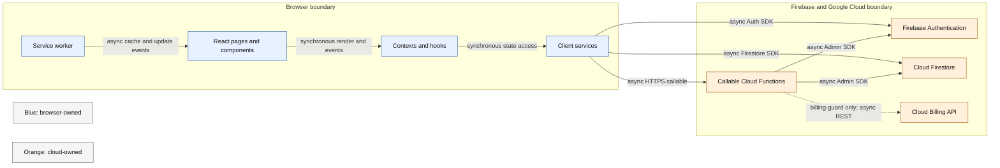

# Application architecture

Runtime boundaries and source paths refer to the checked-out commit and must be reviewed whenever their owning modules move.

## Runtime topology

```mermaid
flowchart LR
  subgraph Browser[Browser boundary]
    UI[React pages and components]
    State[Contexts and hooks]
    Services[Client services]
    PWA[Service worker]
  end

  subgraph Firebase[Firebase and Google Cloud boundary]
    Auth[Firebase Authentication]
    Store[Cloud Firestore]
    Fn[Callable Cloud Functions]
    Billing[Cloud Billing API]
  end

  UI -->|synchronous render and events| State
  State -->|synchronous state access| Services
  Services -->|async Auth SDK| Auth
  Services -->|async Firestore SDK| Store
  Services -->|async HTTPS callable| Fn
  Fn -->|async Admin SDK| Auth
  Fn -->|async Admin SDK| Store
  PWA -->|async cache and update events| UI
  Fn -. billing-guard only; async REST .-> Billing

  classDef browser fill:#e8f1ff,stroke:#3767a6,color:#111;
  classDef cloud fill:#fff0db,stroke:#a66321,color:#111;
  classDef legend fill:#f5f5f5,stroke:#666,color:#111;
  class UI,State,Services,PWA browser;
  class Auth,Store,Fn,Billing cloud;
  LegendBrowser[Blue: browser-owned]:::legend
  LegendCloud[Orange: cloud-owned]:::legend
```

Arrows labelled `synchronous` stay within the browser call stack. Arrows labelled `async` cross an asynchronous API, persistence, or worker boundary.

## Browser responsibilities

| Layer                     | Primary location                                          | Responsibility                                                                                         |
| ------------------------- | --------------------------------------------------------- | ------------------------------------------------------------------------------------------------------ |
| Application shell         | `src/App.tsx`                                             | Global providers, authentication gate, startup states, routes, header, settings, and notifications     |
| Pages and feature UI      | `src/pages/`, `src/components/`                           | Presentation and user interactions                                                                     |
| Shared UI                 | `src/ui/`                                                 | Reusable visual, interaction, and accessibility contracts                                              |
| Context and subscriptions | `src/context/`, `src/hooks/`                              | React state, query construction, listener cleanup, stale-callback protection, and request coordination |
| Backend services          | `src/services/`                                           | Firestore reads and writes, callable invocations, transactions, batches, and persistence boundaries    |
| Domain contracts          | `src/types/`, `src/constants/`, `src/data/`, `src/utils/` | Browser contracts, limits, browser-only reference data, validation and formatting                      |
| Shared rules              | `shared-rules/`                                           | Career, talent and weapon training data, plus pure purchase, cost, rank and Spent XP rules             |

Generic modules must not import feature components. Feature modules may compose shared foundations, while category-specific forms, validation, and card composition remain with their domains.

`shared-rules/` is a package with its own build that both `src/` and `functions/` depend on. `shared-rules/src/index.ts` defines the public API, and both consumers import it as `shared-rules`; neither consumer imports compiled `dist` modules directly. This makes removed or renamed shared exports fail during compilation instead of remaining available through compatibility shims.

`shared-rules/` also holds the Recovery Code format (`RECOVERY_CODE_PREFIX`, `RECOVERY_CODE_SEGMENTS`, `RECOVERY_CODE_SEGMENT_LENGTH`, `RECOVERY_CODE_ALPHABET` and `isRecoveryCodeFormat`) and the claim log action names (`CLAIM_LOG_ACTIONS`). The browser and the Functions both read these from the package. Code generation stays in each environment because the browser and Node use different random sources, and `firestore.rules` keeps its own copy of the format check because rules files cannot import code.

Custom-item data keys and payload bounds also live in `shared-rules/src/customItemValidation.ts`. The browser uses them for early feedback, and the `mutateCustomItem` callable uses the same checks as the trusted write boundary. Direct client create, update and delete operations on custom-item definitions and versions are denied by Firestore Rules. Reads remain available under the existing campaign and creator access checks. The callable checks the authenticated account link and campaign role, then writes the item and version together for draft creation. `scripts/auditCustomItems.mjs` is a read-only pre-rollout scan against the same validator. Set `CUSTOM_ITEM_SCAN_PROJECT_ID` to the exact target project before running `npm run audit:custom-items`.

Run the read-only custom-item audit before each environment rollout and resolve any reported records. On staging, deploy Functions, publish the client that calls them, then deploy the restrictive Firestore Rules. Repeat that order on production. No data migration is required because existing documents keep their current shape. Do not deploy the denying Rules before the client release has propagated.

| Experience component             | Owning location                                  | Responsibility                                                                                         |
| -------------------------------- | ------------------------------------------------ | ------------------------------------------------------------------------------------------------------ |
| Shared Career and purchase rules | `shared-rules/src/`                              | Career progression, Career-table access, purchase attribution, purchase costs and Spent XP calculation |
| Rank card preparation            | `src/mechanics/experience/rankCards.ts`          | Converts character purchases into browser presentation records                                         |
| Rank Up request preparation      | `src/mechanics/experience/xpTransactions.ts`     | Prepares Rank Up choices and spending transactions without authoritatively changing Spent XP           |
| Talent picker calculations       | `src/mechanics/experience/talentAdvanceCosts.ts` | Produces Talent slot, chip and picker information using the shared Career slot rules                   |

`src/firebase.ts` initializes Firebase Authentication, Cloud Firestore, and callable Functions. Portraits are validated and stored as character data; the client does not initialize Firebase Storage.

### Input autofill

Every text, textarea, number, date and search input sets `autoComplete="off"`, because the Android autofill suggestion row takes a large part of the screen above the keyboard and no field collects a password, address or card. Search boxes also use `type="search"` with a `name`, since `autoComplete="off"` alone does not hide the row there; `src/ui/pickers/PickerModal.tsx` owns the shared picker search. `tests/unit/inputAutofill.test.ts` enforces this.

### Pending overlay

`src/ui/PendingOverlay.tsx` is the shared loading indicator. It is a dimmed layer with the loading dots that covers the area that is waiting, and it appears only after `PENDING_OVERLAY_DELAY_MS` (200 milliseconds, `src/constants/ui.ts`) and disappears when the wait ends. A wait shorter than the delay shows nothing. `src/pages/CharacterSheet.tsx` switches tabs inside a React transition, so the previous tab stays on screen while a tab that has not downloaded loads, and the overlay covers the tab area for a slow switch. The sheet downloads the code for all seven on-demand tabs in the background when it opens, and those downloads read no data. Panels that load when pressed stay closed until their data is complete: the Admin tab's claim history (`AdminTab.tsx`), a character's History pop-up (`CharacterRow.tsx`), a DM inbox conversation (`DMInbox.tsx`) and the force-assign player picker (`PlayerPicker.tsx`). The player Messages drawer opens at once and shows the overlay in place of its messages until they arrive (`MessageDrawer.tsx`). A Delete confirmation (`ConfirmInline.tsx`) stays closed until the count of affected documents has loaded, with the overlay over the row or window that was pressed (`CharacterRow.tsx`, `CustomItemAdminRow.tsx`, `Dashboard.tsx`). A character release or loss of access shows the overlay over an empty frame until the Dashboard replaces the page (`CharacterSheet.tsx`). The Experience tab reads its XP history from `src/hooks/xpHistoryStore.ts`, which owns one live listener per character and suspends the first read until the first snapshot arrives, so the tab switch waits for the history like any other tab; the listener is released `XP_HISTORY_RELEASE_MS` (30 seconds) after the last reader leaves.

### Page switching

`src/components/RouteHolder.tsx` owns page switches. When the path changes, the previous page stays visible and usable while the new page is built out of sight beside it, and its listeners start at once. Each part of a page that waits for data registers with `useRouteLoading` (`src/context/useRouteReady.ts`), and the new page replaces the old one when nothing is still waiting, so the Campaign Overview and the Character Sheet appear complete. `PendingOverlay` covers the old page only after `PENDING_OVERLAY_DELAY_MS`. A page still loading after `ROUTE_LOAD_TIMEOUT_MS` (30 seconds, `src/constants/ui.ts`) is revealed with its load error. The first page on a load or reload stays behind the logo screen until it is ready. A page sets its header menu and back link only while it is the visible page (`useRouteActive`). A change to the query string within a page, such as switching tabs, does not rebuild the page.

### Shared card and picker styles

The same kind of element looks and behaves the same everywhere, and colour is the only difference between two uses of one element. Each piece below has one owner.

| Piece               | Owner                                                                                                                                                                                                                                                                                                                                                                    | Role                                                                                                                                                                                                                                                                                  |
| ------------------- | ------------------------------------------------------------------------------------------------------------------------------------------------------------------------------------------------------------------------------------------------------------------------------------------------------------------------------------------------------------------------ | ------------------------------------------------------------------------------------------------------------------------------------------------------------------------------------------------------------------------------------------------------------------------------------- |
| Card                | `uiSectionShell` and `uiSection` in `src/ui/styles/editableStyles.ts`, and `src/ui/Panel.tsx`                                                                                                                                                                                                                                                                            | The bordered card; `uiSection` and `Panel` add the card padding                                                                                                                                                                                                                       |
| Inner box           | `uiCell` in `editableStyles.ts` and `src/ui/chips/StatChip.tsx`                                                                                                                                                                                                                                                                                                          | The bordered box inside a card; `StatChip` is built on it                                                                                                                                                                                                                             |
| Layout recipe       | `uiChipRow`, `uiInlineRow`, `uiSplitRow` and `uiFieldGrid` in `editableStyles.ts`                                                                                                                                                                                                                                                                                        | Shared wrapping chip rows, centred inline rows, split rows and responsive two-column form grids; callers add only their local alignment, margin, size or responsive classes                                                                                                           |
| Chip                | `Chip` in `src/ui/chips/Chip.tsx`, `chipColours` in `src/ui/styles/colourTokens.ts`, and the chip colour lookups in `src/ui/styles/sourceStyles.ts`                                                                                                                                                                                                                      | A compact passive label with one base shape and size scale; a caller picks the colour by name (`colour="amber"`) and never passes colour classes; every named colour uses its matching `500/50` border, `500/10` fill and `300` text, and source abbreviations also use the code font |
| Notice box          | `uiNoticeBox` with `colourNoticeAmber`, `colourNoticePink`, `colourNoticeViolet`, `colourNoticeRed`                                                                                                                                                                                                                                                                      | A tinted box for a warning or highlighted state                                                                                                                                                                                                                                       |
| Text tone           | `colourTextPrimary`, `colourTextBody`, `colourTextMuted`, `colourTextPlaceholder`, `colourErrorText` and `colourSuccessPlain` in `src/ui/styles/colourTokens.ts`, with `uiTextBody`, `uiTextPlaceholder`, `uiTextError`, `uiTextGMNote`, `uiTextDescription`, `uiDescriptionBox`, `uiTextMeta`, `uiRuleName` and `uiThresholdValue` in `src/ui/styles/editableStyles.ts` | Shared colours and text recipes for names and values, body copy, muted and empty text, errors, plain success text, descriptions, supporting lines, rule names and highlighted numbers                                                                                                 |
| Heading             | `uiPageTitle`, `uiToolbarTitle`, `uiModalTitle`, `uiDrawerTitle`, `uiActionRowLabel`, `uiSectionHeader`, `uiSubheading` and `uiCardTitle`                                                                                                                                                                                                                                | Shared roles for page, toolbar, modal, drawer, action-row, section, subheading and card titles                                                                                                                                                                                        |
| Glow pill           | `colourGlowActive` and `colourGlowInactive` in `src/ui/styles/colourTokens.ts`                                                                                                                                                                                                                                                                                           | The pill used for trained and untrained choices                                                                                                                                                                                                                                       |
| Recovery code box   | `uiCodeBox` and `uiCodeText` in `editableStyles.ts`                                                                                                                                                                                                                                                                                                                      | The box that shows a recovery code                                                                                                                                                                                                                                                    |
| Expanding card      | `src/ui/AccordionCard.tsx`                                                                                                                                                                                                                                                                                                                                               | A card whose header button expands the content below it, with the header padding, hover and press of a picker row                                                                                                                                                                     |
| Picker row          | `PickerRow` and `PickerList` in `src/ui/pickers/PickerModal.tsx`                                                                                                                                                                                                                                                                                                         | A card that is one button, with an optional `trailing` slot that holds only an arrow                                                                                                                                                                                                  |
| Picker row contents | `PickerRowName`, `PickerRowChips`, `PickerRowInfoLine` and `PickerRowText` in `src/ui/pickers/PickerRowParts.tsx`                                                                                                                                                                                                                                                        | The name line, the chip row, a label with an info icon, and a description line                                                                                                                                                                                                        |
| Filter button       | `FilterButton` in `src/ui/pickers/FilterButton.tsx`                                                                                                                                                                                                                                                                                                                      | A button in a picker's filter row, such as a class filter or Show all, with centred words, the card border and fill, and no arrow                                                                                                                                                     |
| Form field button   | `PickerField` in `src/ui/pickers/PickerField.tsx`                                                                                                                                                                                                                                                                                                                        | A form box that opens an option list, with a label above, left-aligned words and an arrow on the right                                                                                                                                                                                |
| Text box            | `editableInputClass` and `editableInputColour` in `src/ui/styles/editableStyles.ts`                                                                                                                                                                                                                                                                                      | The box where text or numbers are typed; `editableInputColour` gives the fill, border and red selected border to a box that sets its own size                                                                                                                                         |
| Action button       | `Button` in `src/ui/buttons/Button.tsx`                                                                                                                                                                                                                                                                                                                                  | Every standalone action button, including Back, Wear, Stow, Activate and the Campaign options menu rows, in the `neutral` variant when it carries no meaning of its own                                                                                                               |
| Icon button         | `IconButton` in `src/ui/buttons/IconButton.tsx`                                                                                                                                                                                                                                                                                                                          | Every button that shows only an icon, including Options, the section menu, Messages and scroll to top, with the red outline, press shrink, red focus ring and a spinner while it works                                                                                                |
| Tappable card       | `CardOverlayButton` in `src/ui/buttons/CardOverlayButton.tsx`, with `uiCardTapHeader` in `buttonStyles.ts` and `uiCardTitleHover` in `editableStyles.ts`                                                                                                                                                                                                                 | The invisible button over a card header that chooses or expands the card; the header lightens on hover, the button sinks when pressed and shows a red focus ring, and the title turns white on hover                                                                                  |
| Toggle button       | `ToggleButton` and `toggleButtonClass` in `src/ui/buttons/ToggleButton.tsx`                                                                                                                                                                                                                                                                                              | One button in a pick-one row, such as craftsmanship, a weapon profile or a starting choice; the unselected look and the pressed state are shared, and the caller passes the selected colour and its own size                                                                          |
| Required mark       | `RequiredMark` in `src/ui/forms/RequiredMark.tsx`                                                                                                                                                                                                                                                                                                                        | The asterisk beside a required field, in `colourRequiredText` and hidden from screen readers; `RequiredFormLabel`, the required note and every hand-labelled field use it                                                                                                             |
| Expand button       | `ExpandButton` in `src/ui/buttons/ExpandButton.tsx`                                                                                                                                                                                                                                                                                                                      | The chevron that expands or collapses a card's details, above the card's tap overlay                                                                                                                                                                                                  |
| Reveal button       | `RevealCodeButton` in `src/ui/buttons/RevealCodeButton.tsx`, with `uiTextButton` in `buttonStyles.ts`                                                                                                                                                                                                                                                                    | The underlined inline link that shows a recovery code, with waiting dots while it loads                                                                                                                                                                                               |
| Info button         | `uiInfoButton` in `src/ui/styles/buttonStyles.ts`                                                                                                                                                                                                                                                                                                                        | The small raised button of `InfoModal` and `Tooltip`                                                                                                                                                                                                                                  |
| Step button         | `uiStepButtonColour` and `uiStepButtonDisabled` in `buttonStyles.ts`                                                                                                                                                                                                                                                                                                     | The plus and minus buttons of `Stepper` and `QuantityControl`                                                                                                                                                                                                                         |

Every picker row builds its inside from the four row content pieces, and these gaps apply to all of them:

| Part             | Gap above (px) | Text                                                  |
| ---------------- | -------------- | ----------------------------------------------------- |
| Name line        | 0              | `uiItemNameHover`, which wraps and is never truncated |
| Chip row         | 4              | Chips set their own size                              |
| Info line        | 4              | Small label, optional text, then the info icon        |
| Description line | 4              | Small `uiTextBody` text                               |

`PowerCard` uses its four-column grid on a phone and changes to the same wrapping layout and gap as `uiChipRow` on desktop. The responsive classes remain with `PowerCard` because applying `uiChipRow` at every size would replace its phone grid.

`PickerRow` adds the `group` class only when the row responds to a press, so the name turns white on hover and the box lightens together, and a read-only row shows neither. Pressing an info icon opens its pop-up and does not select the row (`PickerRowName`, `PickerRowInfoLine`). A row never places chips or a cost to the right of its name. The body font, IM Fell English, loads in its normal and italic faces (`src/main.tsx`), and `font-synthesis: none` in `src/index.css` stops the browser from faking an italic; no component sets italic text.

Use `uiTextBody` for readable rules, notes and explanations, and `uiTextDescription` for a description paragraph inside a modal, a picker detail screen or a card body, with `uiDescriptionBox` for the filled box that holds it on an item detail screen. Use `uiTextMeta` for a small supporting line such as a date, a creator or a count, `uiTextPlaceholder` for an empty, missing or optional value, and `uiTextError` for a plain inline error message, while the component keeps its own size. Use `uiRuleName` for a rule or ability name above its description inside an info modal, `uiThresholdValue` for a bold highlighted number inside a sentence, and `colourAmberPlain` for secondary game information such as a granted source or stowed quantity. Use `colourSuccessPlain` for a plain success message.

Shared text-tone tokens do not replace specialist visual styles. Controls own their hover, focus, disabled and selected states. Chips and badges own a linked border, fill and text treatment. Colours on mechanical values, thresholds, rewards, danger states, side effects and terminal outcomes carry game information and remain with the component or domain token that owns that meaning.

### Chip colours

Every chip takes its colour from the 18 names in `chipColours` (`src/ui/styles/colourTokens.ts`). The same meaning always gets the same colour: an XP cost, a price, an Owned tag, a Draft tag, the roll chip and the Archeotech label are all amber, and weight, per-quantity and neutral labels are slate. Each map below returns a colour name, and a component that needs the class string for a toggle's selected look reads `chipColours[name]`.

| Meaning                            | Owner                                                                                             | Colours                                                                                                                            |
| ---------------------------------- | ------------------------------------------------------------------------------------------------- | ---------------------------------------------------------------------------------------------------------------------------------- |
| Source book                        | `sourceChipColour` in `src/ui/styles/sourceStyles.ts`                                             | One colour per source code; the core rulebook and unknown sources are slate                                                        |
| Availability                       | `availabilityChipColour` in `sourceStyles.ts`                                                     | One colour per availability; Adeptus Mechanicus Only and Tech-Priest Only are both red; unrecognised and compound values are slate |
| Characteristic                     | `characteristicChipColour` in `sourceStyles.ts`                                                   | Amber for combat, green for physical, blue for mental, pink for social                                                             |
| Weapon class, type and ammo family | `weaponClassChip`, `weaponTypeChip`, `ammoFamilyChip` and `meleeClassChips` in `weaponHelpers.ts` | Las is red, Launcher yellow, Exotic fuchsia, and SP weapons and Solid Projectile ammo teal, on every chip that shows them          |
| Craftsmanship                      | `CRAFTSMANSHIP_COLOUR` in `src/ui/styles/craftsmanship.ts`                                        | Poor red, Common slate, Good emerald, Best amber; `CRAFTSMANSHIP_STYLE` holds the selected look of the craftsmanship toggles       |
| Custom item status                 | `StatusBadge` in `src/ui/chips/StatusBadge.tsx`                                                   | Published emerald, draft amber, archived slate                                                                                     |
| Psychic discipline and selection   | `disciplineColours` and `psychicSelectionSourceColours` in `PsychicTab/psychicStyles.ts`          | One colour per discipline; a Talent selection is amber and a Psy Rating selection is indigo                                        |
| Insanity and corruption            | `insanityUi.ts` and `corruptionUi.ts`                                                             | Degree, severity and disorder type colours                                                                                         |
| Faith Talent group                 | `FAITH_TALENT_GROUP_CHIP_COLOURS` in `src/mechanics/talents/faithTalentGroups.ts`                 | General slate, Sign violet, Mercy emerald, Wrath amber                                                                             |
| Rank card entry kind               | `ENTRY_KIND_COLOURS` in `ExperienceTab.tsx`                                                       | One colour per kind of purchase                                                                                                    |
| Skill level and kind               | `LEVEL_BADGE` in `SkillsTab/SkillRow.tsx`                                                         | Untrained red, Trained orange, +10 sky, +20 green; Basic teal and Advanced purple                                                  |

`tests/integration/Chip.test.tsx`, `tests/unit/sourceStyles.test.ts` and `tests/unit/weaponHelpers.test.ts` cover the palette and the maps.

### Text and surface colours

Raw colour classes are written only in `src/ui/styles/colourTokens.ts`, in the palette files `sourceStyles.ts` and `craftsmanship.ts`, in the chip styles, in the `Button` variant map, and in the style definitions under `src/ui/styles`. Every other file names a token, so a colour changes in one place.

| Group                       | Tokens                                                                                                                                                                                                                                                                                                                            | Use                                                                                                             |
| --------------------------- | --------------------------------------------------------------------------------------------------------------------------------------------------------------------------------------------------------------------------------------------------------------------------------------------------------------------------------- | --------------------------------------------------------------------------------------------------------------- |
| Primary and supporting text | `colourTextPrimary` (names, values, headings, form labels), `colourTextBody`, `colourTextMuted`, `colourTextPlaceholder`, `colourMetadataLabelText`, `colourTextGMNote`                                                                                                                                                           | The grey scale of text, from the lightest name to a placeholder, and the sky blue of small labels               |
| Accent and state text       | `colourHeadingAccent` (red titles), `colourErrorText` (errors, required marks, negative values), `colourSuccessPlain`, `colourAmberPlain`, `colourNoticeAmberTitle`, `colourNoticeAmberText`, `colourOnAmberDim`, `colourTerminalText`, `colourPsychicText`, `colourDrugNoticeText`, `colourSplashTitle`, `colourCustomEntryText` | Text that carries a title, a warning or a game meaning                                                          |
| Dividers and borders        | `colourDivider`, `colourDivideList`, `colourAccentBar`, `colourBorderRed`, `colourBorderControl`, `colourSplashRule`                                                                                                                                                                                                              | The line between sections, the line between list rows, the red accent bar and the control border                |
| Surfaces                    | `colourPageBackground`, `colourPopoverSurface`, `colourModalSurface`, `colourFillPanel`, `colourFillRaised`, `colourFillControl`, `colourFillInset`, `colourFillSelected`, `colourFillHeader`, `colourFillFloating`, `colourControlSurface`, `colourControlRaised`, `colourTabTrackSurface`, `colourEditOverrideSurface`          | The fill of the page, menus, drawers, modals, panels, controls, inset boxes, the header and the floating button |
| Controls and marks          | `colourControlSurfaceDisabled`, `colourControlDivider`, `colourControlDividerDisabled`, `colourControlShadow`, `colourStateRed`, `colourAdvanceFilled`, `colourAdvanceEmpty`, `colourDotLoaded`, `colourDotIdle`, `colourTimelineMarker`, `colourQrBackground`                                                                    | The counter, the characteristic advance squares, the loaded dot, the timeline marker and the QR background      |
| Selected toggles            | `colourToggleSelectedNeutral`, `Sky`, `Amber`, `AmberSoft`, `Red`, `Violet` and `Fuchsia`                                                                                                                                                                                                                                         | The selected look of a pick-one button                                                                          |
| Palettes                    | `degreeTextColour` and `degreeBarColour` (Insanity and Corruption steps), `damageTypeTextColour`, `toastColours`                                                                                                                                                                                                                  | One colour set shared by every place that shows the same meaning                                                |

Hover, focus, press and disabled colours stay inside the style of the control that owns them. `tests/unit/textRecipes.test.ts` fails when a hand-typed text, background, border or divider colour, or a copy of the shared text recipes, appears outside the files listed above and the files that own hover, icon, table and backdrop colours.

## Navigation and startup

The routed application exposes these canonical paths:

| Route                                          | Owner             |
| ---------------------------------------------- | ----------------- |
| `/`                                            | Dashboard         |
| `/campaign/:campaignId`                        | Campaign overview |
| `/campaign/:campaignId/character/:characterId` | Character sheet   |

Settings is a modal owned by the application shell. Legacy path constants such as `/dm`, `/player`, and `/select` are not registered routes and fall through to the dashboard.

`CampaignsProvider` is global in `src/App.tsx`; its active DM, active member and archived campaign subscriptions start during authenticated startup and remain active across routes. Route pages add only their own scoped subscriptions.

### Startup gate

`src/components/StartupGate.tsx` keeps the logo screen until the active DM campaigns, the active member campaigns, the archived campaigns and the recovery backup status have all arrived, so the Dashboard and its backup banner appear complete. `src/components/StartupErrorModal.tsx` shows a modal over the logo screen when any of those loads fails or when startup exceeds `STARTUP_LOAD_TIMEOUT_MS` (30 seconds, `src/constants/ui.ts`). The modal cannot be closed and offers one Try Again action that reloads the application. Failures in sign-in, the device list and the profile use the same modal. The gate decides once: after the application has opened, a later listener error appears in the affected list and never replaces the application.

## Query and product bounds

`src/constants/firestoreLimits.ts` is authoritative for live query windows.

| Query                             | Maximum requested documents |
| --------------------------------- | --------------------------: |
| Active DM campaigns               |                         100 |
| Active member campaigns           |                         100 |
| Archived campaigns                |                         100 |
| Campaign characters               |                         100 |
| Owned-character collection group  |                       1,000 |
| Session records or summaries      |                         200 |
| Thread summaries                  |                         100 |
| Current or requested message page |                         100 |
| Claim history page                |                          50 |
| XP history page                   |                         100 |
| Custom-item query                 |                         200 |

These values limit reads; they do not prove collection-size enforcement. `src/constants/productLimits.ts` declares product policy, while the enforcement layer differs by value.

| Policy value               |         Declared limit with units | Current enforcement                                               |
| -------------------------- | --------------------------------: | ----------------------------------------------------------------- |
| Campaign creation rate     | 10 creations per rolling 24 hours | Protected `createCampaign` operation                              |
| Campaigns per account      |                     100 campaigns | Protected `createCampaign` count check                            |
| Campaign members           |                   100 account IDs | Firestore rule validates the stored member array                  |
| Characters per campaign    |                    100 characters | Query window and declared policy; no collection-count write check |
| Linked devices per account |                        10 devices | Protected `linkDevice` count check                                |
| Custom items per campaign  |                         200 items | Query window and declared policy; no collection-count write check |
| Character import payload   |                     750,000 bytes | Client import validation                                          |
| Character document budget  |                     900,000 bytes | Application field and document validation                         |
| Character Total XP         |                     10,000,000 XP | `adjustCharacterXp` and session XP operation validation           |
| XP history reason          |                  4,000 characters | `adjustCharacterXp` operation validation                          |

## Trust and persistence boundaries

Firestore rules authorise every direct client read and write. `SECURITY_RULES.md` summarises that contract. Operations with sensitive cross-document or server-authority requirements use callable functions under `functions/src/operations/`.

Character field edits go through the `patchCharacterField` callable. Each field has a shape and size validator, and fields that carry XP-priced purchases also have a transition validator in `functions/src/shared/characterFieldValidation.ts`. A transition validator compares the proposed value with the stored character and the caller's role, using the same `shared-rules` cost and rank functions as the browser, including the character's selected Alternate Rank tables:

- `characteristics`: each newly bought advance is recorded at the career table cost, and no advance past the fourth tier is accepted.
- `skills`: each newly bought tier uses its Career-table cost, `getMissedRankCareerAdvances` prices a replaced normal-Rank Skill at its original cost plus 50 XP from the following Career tier, and a `gm-approved` Show all purchase requires matching recorded costs and DM authority even when the Skill is otherwise locked.
- `talentsAndTraits`: `assertValidTalentsAndTraitsTransition` checks new Career-table Talents and Traits against `getNextTalentOrTraitPurchase`, validates missed-rank and packaged Talent provenance, restricts manually priced Show all purchases to the DM, and validates purchased or automatically granted packaged Elite Advances. `isCustomTraitEntry` permits campaign custom Traits, while `isPurityReplacement` permits the free Reformed Skin entry created with a Purity of Flesh acquisition.
- `weaponTraining`: each newly trained fixed group is recorded at the career table cost, a group off the table is priced only by the DM, each career-table Exotic specialisation uses its printed cost and source rank, and only the DM adds off-Career Exotic Training as bonus training.
- `experience`: a player adds an Alternate Rank only when the career matches, the rank it replaces is one of the character's valid next ranks and meets the Alternate Rank's minimum rank, and it appears only once. The DM may set any Alternate Rank selection. `assertValidExperienceTransition` rejects direct changes to Total XP or Spent XP for every caller. `assertPlayerExperienceLedgerUnchanged` prevents players from adding, removing or changing the legacy Rank advance ledger or XP spending transactions; only the DM may manage those records. Current Career purchases use their dedicated fields and Career-table validators instead of creating legacy Rank advances.

`patchCharacterField` supplies transition validators with the complete proposed character, so one atomic update can validate a packaged Elite Advance and its unlocked Talent, or an Alternate Rank and its automatic packaged grant. Decreases and removals are not checked, because only additions create free XP. Fields without a transition validator are checked for shape and size only.

`assertExistingPurchasePricesUnchanged` protects retained XP purchase prices in Characteristics, Skills, Talents, Traits, packaged Elite Advances and Weapon Training. A player with character editing access may remove a purchase for a refund, but cannot add, remove or alter any cost field on a purchase that remains owned. The DM may reprice a retained purchase.

### Spent XP accounting

Spent XP is derived from persisted purchases and spending transactions. The browser may calculate the same value for presentation, but it does not supply the value accepted by the server.

| Behaviour                    | Owning component                                                                              | Server boundary                                                                                                                                                                   |
| ---------------------------- | --------------------------------------------------------------------------------------------- | --------------------------------------------------------------------------------------------------------------------------------------------------------------------------------- |
| Purchase total in XP         | `getSpentXp` in `shared-rules/src/xpSpent.ts`                                                 | Totals Rank advances, spending transactions, Characteristic Advances, Skills, Talents, Traits, standalone Elite Advances and Weapon Training                                      |
| Talent and Trait total in XP | `getTalentsSpent` in `shared-rules/src/talentAdvanceCosts.ts`                                 | Uses persisted purchase prices first and supports legacy Career-table or manual prices                                                                                            |
| Experience ledger protection | `assertPlayerExperienceLedgerUnchanged` in `functions/src/shared/characterFieldValidation.ts` | Keeps legacy Rank advances and XP spending transactions immutable for players while allowing DM management                                                                        |
| Atomic purchase validation   | `patchCharacterField` in `functions/src/operations/patchCharacterField.ts`                    | Calculates the complete proposed character total, rejects the full patch when Spent XP would exceed Total XP, and stores the calculated `experience.spent` with an accepted patch |
| Stored-value repair          | `reconcileCharacterSpentXp` in `functions/src/operations/reconcileCharacterSpentXp.ts`        | Accepts only character identity, recalculates from the freshly read character and updates only `experience.spent`                                                                 |
| Budget enforcement           | `assertCharacterXpBudget` in `functions/src/shared/spentXp.ts`                                | Rejects any proposed purchase state whose calculated Spent XP exceeds server-owned Total XP                                                                                       |

`adjustCharacterXp`, `applySessionXp` and `deleteSession` also recalculate Spent XP from stored purchases. A negative adjustment or session reversal is rejected atomically when its resulting Total XP would be lower than calculated Spent XP. A session award remains atomic across all attendees: invalid stored purchase data for any attendee rejects the complete award without changing another attendee, the session or XP history.

### XP history

Total XP is a server-maintained aggregate. The Experience page displays its read-only history beneath the Total, Spent and Remaining XP summary.

| Behaviour                              | Owning component                                                       | Persistence boundary                                                                                                                           |
| -------------------------------------- | ---------------------------------------------------------------------- | ---------------------------------------------------------------------------------------------------------------------------------------------- |
| Manual positive or negative adjustment | `adjustCharacterXp` in `functions/src/operations/adjustCharacterXp.ts` | Updates `experience.total` and appends `/campaigns/{campaignId}/characters/{characterId}/xpHistory/{entryId}` in one transaction               |
| Existing-character baseline            | `stageOpeningBalance` in `functions/src/shared/xpHistory.ts`           | Creates the immutable `opening-balance` entry before the first adjustment                                                                      |
| Session award                          | `applySessionXp` in `functions/src/operations/sessionXp.ts`            | Uses the stored session attendees and XP amount, updates every attendee total, writes history and marks the session applied in one transaction |
| Session deletion with reversal         | `deleteSession` in `functions/src/operations/sessionXp.ts`             | Writes a negative history entry, updates every attendee total and deletes the session records in one transaction                               |
| History subscription                   | `useXpHistory` in `src/hooks/useXpHistory.ts`                          | Reads at most 100 newest entries ordered by creation time                                                                                      |
| History presentation                   | `ExperienceTab` in `src/pages/CharacterSheet/ExperienceTab.tsx`        | Shows amount in XP, resulting balance in XP, reason, actor and local date and time                                                             |

An editable owning player and an actively editing DM may record a manual adjustment. The resulting Total XP must remain at or above server-calculated Spent XP and may not exceed 10,000,000 XP. History entries are server-written and cannot be edited or deleted directly. A correction is a new positive or negative entry.

| Callable error code   | Meaning                                                         |
| --------------------- | --------------------------------------------------------------- |
| `unauthenticated`     | Firebase Authentication is missing or invalid                   |
| `permission-denied`   | The effective account lacks authority                           |
| `invalid-argument`    | The request payload fails validation                            |
| `not-found`           | A required target no longer exists                              |
| `already-exists`      | The requested identity or transition already exists             |
| `resource-exhausted`  | A rate, count, or bounded-operation limit is exceeded           |
| `failed-precondition` | Current stored state does not permit the operation              |
| `internal`            | An unexpected failure was converted to the generic safe message |

UI code must branch on error codes rather than private server details.

Text-field persistence is debounced by 600 milliseconds. Quantity deltas are coalesced for 300 milliseconds. Direct Firestore writes remain subject to rules; protected operations validate authority and state again on the server.

## Destructive and resumable operations

Campaign and character deletion use protected resumable jobs:

1. The protected preflight authorises the caller, counts affected documents, and stores a job without deleting descendants.
2. The client displays the stored count.
3. The user confirms processing in the UI.
4. The client requests bounded chunks until completion.

Parent documents are removed last so interrupted work can resume without leaving descendants detached from an existing parent.

The confirmation is a client workflow boundary, not a server-validated count token. Processing reauthorises the caller but does not perform a fresh count comparison at confirmation time.

Account deletion is a separate bounded transaction. It refuses deletion while the account owns campaigns and refuses a write set above its transaction ceiling.

Preconditions and failure behaviour are part of each operation's contract:

| Operation            | Required precondition                                                                                              | Failure behaviour                                                                           |
| -------------------- | ------------------------------------------------------------------------------------------------------------------ | ------------------------------------------------------------------------------------------- |
| Campaign deletion    | Caller is the campaign DM; every character has a valid Recovery Code; preflight count is at most 100,000 documents | Preflight creates no descendant deletion; processing reauthorises the caller and can resume |
| Character deletion   | Caller is the campaign DM; the character has a valid Recovery Code; preflight count is at most 100,000 documents   | Parent character remains until descendant cleanup completes                                 |
| Account deletion     | No owned campaigns and cleanup fits the bounded transaction                                                        | Transaction performs no partial Firestore cleanup on rejection                              |
| Ownership transition | Caller has operation-specific authority and current state matches                                                  | Transaction rejects races without a partial transition                                      |

## Cloud runtime

| Functions workload          | Region         |    Timeout | Maximum instances | Concurrency per instance |
| --------------------------- | -------------- | ---------: | ----------------: | -----------------------: |
| Ordinary protected callable | `europe-west2` | 30 seconds |       5 instances |              40 requests |
| Heavy protected callable    | `europe-west2` | 30 seconds |       2 instances |               5 requests |
| Account deletion            | `europe-west2` | 60 seconds |       5 instances |              40 requests |

All three workloads target Node.js 22. Account deletion uses its dedicated runtime service account.

HMAC material is supplied through the deployed Functions secrets `RECOVERY_CODE_HMAC_SECRET` and `IDENTITY_CODE_HMAC_SECRET`, declared in `functions/src/shared/secrets.ts`. Secret values must never enter browser configuration or repository files.

The isolated `billing-guard/` package receives budget events and may detach billing from the two monitored projects. It is operational infrastructure, not part of the application request path.

## Progressive web application boundary

The production build registers a service worker and caches build assets. Startup state is coordinated between the pre-React registration code and the React shell so an unavailable registration or stalled update does not leave the interface permanently blocked. Cached-asset consistency is enforced by `npm run check:build-inventory`.

## Deployment boundary

Firebase Hosting serves `dist/` and rewrites application routes to the SPA entry point. `scripts/buildForDeploy.mjs` prepares the deployment build. Security headers and the Content Security Policy are defined in `firebase.json` and must be reviewed when external origins or runtime capabilities change.

Repository installation, test commands, and performance-harness methodology belong in `CONTRIBUTING.md`, not in this architecture contract.
