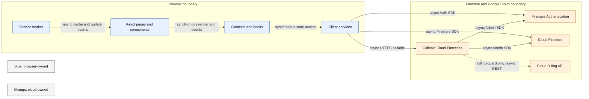

# Application architecture

Runtime boundaries and source paths refer to the checked-out commit and must be reviewed whenever their owning modules move.

## Runtime topology

```mermaid
flowchart LR
  subgraph Browser[Browser boundary]
    UI[React pages and components]
    State[Contexts and hooks]
    Services[Client services]
    PWA[Service worker]
  end

  subgraph Firebase[Firebase and Google Cloud boundary]
    Auth[Firebase Authentication]
    Store[Cloud Firestore]
    Fn[Callable Cloud Functions]
    Billing[Cloud Billing API]
  end

  UI -->|synchronous render and events| State
  State -->|synchronous state access| Services
  Services -->|async Auth SDK| Auth
  Services -->|async Firestore SDK| Store
  Services -->|async HTTPS callable| Fn
  Fn -->|async Admin SDK| Auth
  Fn -->|async Admin SDK| Store
  PWA -->|async cache and update events| UI
  Fn -. billing-guard only; async REST .-> Billing

  classDef browser fill:#e8f1ff,stroke:#3767a6,color:#111;
  classDef cloud fill:#fff0db,stroke:#a66321,color:#111;
  classDef legend fill:#f5f5f5,stroke:#666,color:#111;
  class UI,State,Services,PWA browser;
  class Auth,Store,Fn,Billing cloud;
  LegendBrowser[Blue: browser-owned]:::legend
  LegendCloud[Orange: cloud-owned]:::legend
```

Arrows labelled `synchronous` stay within the browser call stack. Arrows labelled `async` cross an asynchronous API, persistence, or worker boundary.

## Browser responsibilities

| Layer                     | Primary location                                          | Responsibility                                                                                         |
| ------------------------- | --------------------------------------------------------- | ------------------------------------------------------------------------------------------------------ |
| Application shell         | `src/App.tsx`                                             | Global providers, authentication gate, startup states, routes, header, settings, and notifications     |
| Pages and feature UI      | `src/pages/`, `src/components/`                           | Presentation and user interactions                                                                     |
| Shared UI                 | `src/ui/`                                                 | Reusable visual, interaction, and accessibility contracts                                              |
| Context and subscriptions | `src/context/`, `src/hooks/`                              | React state, query construction, listener cleanup, stale-callback protection, and request coordination |
| Backend services          | `src/services/`                                           | Firestore reads and writes, callable invocations, transactions, batches, and persistence boundaries    |
| Domain contracts          | `src/types/`, `src/constants/`, `src/data/`, `src/utils/` | Browser contracts, limits, browser-only reference data, validation and formatting                      |
| Shared rules              | `shared-rules/`                                           | Career, talent and weapon training data, plus pure purchase, cost, rank and Spent XP rules             |

Generic modules must not import feature components. Feature modules may compose shared foundations, while category-specific forms, validation, and card composition remain with their domains.

`shared-rules/` is a package with its own build that both `src/` and `functions/` depend on. `shared-rules/src/index.ts` defines the public API, and both consumers import it as `shared-rules`; neither consumer imports compiled `dist` modules directly. This makes removed or renamed shared exports fail during compilation instead of remaining available through compatibility shims.

`shared-rules/` also holds the Recovery Code format (`RECOVERY_CODE_PREFIX`, `RECOVERY_CODE_SEGMENTS`, `RECOVERY_CODE_SEGMENT_LENGTH`, `RECOVERY_CODE_ALPHABET` and `isRecoveryCodeFormat`) and the claim log action names (`CLAIM_LOG_ACTIONS`). The browser and the Functions both read these from the package. Code generation stays in each environment because the browser and Node use different random sources, and `firestore.rules` keeps its own copy of the format check because rules files cannot import code.

| Experience component             | Owning location                                  | Responsibility                                                                                         |
| -------------------------------- | ------------------------------------------------ | ------------------------------------------------------------------------------------------------------ |
| Shared Career and purchase rules | `shared-rules/src/`                              | Career progression, Career-table access, purchase attribution, purchase costs and Spent XP calculation |
| Rank card preparation            | `src/mechanics/experience/rankCards.ts`          | Converts character purchases into browser presentation records                                         |
| Rank Up request preparation      | `src/mechanics/experience/xpTransactions.ts`     | Prepares Rank Up choices and spending transactions without authoritatively changing Spent XP           |
| Talent picker calculations       | `src/mechanics/experience/talentAdvanceCosts.ts` | Produces Talent slot, chip and picker information using the shared Career slot rules                   |

`src/firebase.ts` initializes Firebase Authentication, Cloud Firestore, and callable Functions. Portraits are validated and stored as character data; the client does not initialize Firebase Storage.

### Input autofill

Every text, textarea, number, date and search input sets `autoComplete="off"`, because the Android autofill suggestion row takes a large part of the screen above the keyboard and no field collects a password, address or card. Search boxes also use `type="search"` with a `name`, since `autoComplete="off"` alone does not hide the row there; `src/ui/pickers/PickerModal.tsx` owns the shared picker search. `tests/unit/inputAutofill.test.ts` enforces this.

### Pending overlay

`src/ui/PendingOverlay.tsx` is the shared loading indicator. It is a dimmed layer with the loading dots that covers the area that is waiting, and it appears only after `PENDING_OVERLAY_DELAY_MS` (200 milliseconds, `src/constants/ui.ts`) and disappears when the wait ends. A wait shorter than the delay shows nothing. `src/pages/CharacterSheet.tsx` switches tabs inside a React transition, so the previous tab stays on screen while a tab that has not downloaded loads, and the overlay covers the tab area for a slow switch. The sheet downloads the code for all seven on-demand tabs in the background when it opens, and those downloads read no data.

## Navigation and startup

The routed application exposes these canonical paths:

| Route                                          | Owner             |
| ---------------------------------------------- | ----------------- |
| `/`                                            | Dashboard         |
| `/campaign/:campaignId`                        | Campaign overview |
| `/campaign/:campaignId/character/:characterId` | Character sheet   |

Settings is a modal owned by the application shell. Legacy path constants such as `/dm`, `/player`, and `/select` are not registered routes and fall through to the dashboard.

`CampaignsProvider` is global in `src/App.tsx`; its active DM, active member and archived campaign subscriptions start during authenticated startup and remain active across routes. Route pages add only their own scoped subscriptions.

### Startup gate

`src/components/StartupGate.tsx` keeps the logo screen until the active DM campaigns, the active member campaigns, the archived campaigns and the recovery backup status have all arrived, so the Dashboard and its backup banner appear complete. `src/components/StartupErrorModal.tsx` shows a modal over the logo screen when any of those loads fails or when startup exceeds `STARTUP_LOAD_TIMEOUT_MS` (30 seconds, `src/constants/ui.ts`). The modal cannot be closed and offers one Try Again action that reloads the application. Failures in sign-in, the device list and the profile use the same modal. The gate decides once: after the application has opened, a later listener error appears in the affected list and never replaces the application.

## Query and product bounds

`src/constants/firestoreLimits.ts` is authoritative for live query windows.

| Query                             | Maximum requested documents |
| --------------------------------- | --------------------------: |
| Active DM campaigns               |                         100 |
| Active member campaigns           |                         100 |
| Archived campaigns                |                         100 |
| Campaign characters               |                         100 |
| Owned-character collection group  |                       1,000 |
| Session records or summaries      |                         200 |
| Thread summaries                  |                         100 |
| Current or requested message page |                         100 |
| Claim history page                |                          50 |
| XP history page                   |                         100 |
| Custom-item query                 |                         200 |

These values limit reads; they do not prove collection-size enforcement. `src/constants/productLimits.ts` declares product policy, while the enforcement layer differs by value.

| Policy value               |         Declared limit with units | Current enforcement                                               |
| -------------------------- | --------------------------------: | ----------------------------------------------------------------- |
| Campaign creation rate     | 10 creations per rolling 24 hours | Protected `createCampaign` operation                              |
| Campaigns per account      |                     100 campaigns | Protected `createCampaign` count check                            |
| Campaign members           |                   100 account IDs | Firestore rule validates the stored member array                  |
| Characters per campaign    |                    100 characters | Query window and declared policy; no collection-count write check |
| Linked devices per account |                        10 devices | Protected `linkDevice` count check                                |
| Custom items per campaign  |                         200 items | Query window and declared policy; no collection-count write check |
| Character import payload   |                     750,000 bytes | Client import validation                                          |
| Character document budget  |                     900,000 bytes | Application field and document validation                         |
| Character Total XP         |                     10,000,000 XP | `adjustCharacterXp` and session XP operation validation           |
| XP history reason          |                  4,000 characters | `adjustCharacterXp` operation validation                          |

## Trust and persistence boundaries

Firestore rules authorise every direct client read and write. `SECURITY_RULES.md` summarises that contract. Operations with sensitive cross-document or server-authority requirements use callable functions under `functions/src/operations/`.

Character field edits go through the `patchCharacterField` callable. Each field has a shape and size validator, and fields that carry XP-priced purchases also have a transition validator in `functions/src/shared/characterFieldValidation.ts`. A transition validator compares the proposed value with the stored character and the caller's role, using the same `shared-rules` cost and rank functions as the browser, including the character's selected Alternate Rank tables:

- `characteristics`: each newly bought advance is recorded at the career table cost, and no advance past the fourth tier is accepted.
- `skills`: each newly bought tier uses its Career-table cost, `getMissedRankCareerAdvances` prices a replaced normal-Rank Skill at its original cost plus 50 XP from the following Career tier, and a `gm-approved` Show all purchase requires matching recorded costs and DM authority even when the Skill is otherwise locked.
- `talentsAndTraits`: `assertValidTalentsAndTraitsTransition` checks new Career-table Talents and Traits against `getNextTalentOrTraitPurchase`, validates missed-rank and packaged Talent provenance, restricts manually priced Show all purchases to the DM, and validates purchased or automatically granted packaged Elite Advances. `isCustomTraitEntry` permits campaign custom Traits, while `isPurityReplacement` permits the free Reformed Skin entry created with a Purity of Flesh acquisition.
- `weaponTraining`: each newly trained fixed group is recorded at the career table cost, a group off the table is priced only by the DM, each career-table Exotic specialisation uses its printed cost and source rank, and only the DM adds off-Career Exotic Training as bonus training.
- `experience`: a player adds an Alternate Rank only when the career matches, the rank it replaces is one of the character's valid next ranks and meets the Alternate Rank's minimum rank, and it appears only once. The DM may set any Alternate Rank selection. `assertValidExperienceTransition` rejects direct changes to Total XP or Spent XP for every caller. `assertPlayerExperienceLedgerUnchanged` prevents players from adding, removing or changing the legacy Rank advance ledger or XP spending transactions; only the DM may manage those records. Current Career purchases use their dedicated fields and Career-table validators instead of creating legacy Rank advances.

`patchCharacterField` supplies transition validators with the complete proposed character, so one atomic update can validate a packaged Elite Advance and its unlocked Talent, or an Alternate Rank and its automatic packaged grant. Decreases and removals are not checked, because only additions create free XP. Fields without a transition validator are checked for shape and size only.

`assertExistingPurchasePricesUnchanged` protects retained XP purchase prices in Characteristics, Skills, Talents, Traits, packaged Elite Advances and Weapon Training. A player with character editing access may remove a purchase for a refund, but cannot add, remove or alter any cost field on a purchase that remains owned. The DM may reprice a retained purchase.

### Spent XP accounting

Spent XP is derived from persisted purchases and spending transactions. The browser may calculate the same value for presentation, but it does not supply the value accepted by the server.

| Behaviour                    | Owning component                                                                              | Server boundary                                                                                                                                                                   |
| ---------------------------- | --------------------------------------------------------------------------------------------- | --------------------------------------------------------------------------------------------------------------------------------------------------------------------------------- |
| Purchase total in XP         | `getSpentXp` in `shared-rules/src/xpSpent.ts`                                                 | Totals Rank advances, spending transactions, Characteristic Advances, Skills, Talents, Traits, standalone Elite Advances and Weapon Training                                      |
| Talent and Trait total in XP | `getTalentsSpent` in `shared-rules/src/talentAdvanceCosts.ts`                                 | Uses persisted purchase prices first and supports legacy Career-table or manual prices                                                                                            |
| Experience ledger protection | `assertPlayerExperienceLedgerUnchanged` in `functions/src/shared/characterFieldValidation.ts` | Keeps legacy Rank advances and XP spending transactions immutable for players while allowing DM management                                                                        |
| Atomic purchase validation   | `patchCharacterField` in `functions/src/operations/patchCharacterField.ts`                    | Calculates the complete proposed character total, rejects the full patch when Spent XP would exceed Total XP, and stores the calculated `experience.spent` with an accepted patch |
| Stored-value repair          | `reconcileCharacterSpentXp` in `functions/src/operations/reconcileCharacterSpentXp.ts`        | Accepts only character identity, recalculates from the freshly read character and updates only `experience.spent`                                                                 |
| Budget enforcement           | `assertCharacterXpBudget` in `functions/src/shared/spentXp.ts`                                | Rejects any proposed purchase state whose calculated Spent XP exceeds server-owned Total XP                                                                                       |

`adjustCharacterXp`, `applySessionXp` and `deleteSession` also recalculate Spent XP from stored purchases. A negative adjustment or session reversal is rejected atomically when its resulting Total XP would be lower than calculated Spent XP. A session award remains atomic across all attendees: invalid stored purchase data for any attendee rejects the complete award without changing another attendee, the session or XP history.

### XP history

Total XP is a server-maintained aggregate. The Experience page displays its read-only history beneath the Total, Spent and Remaining XP summary.

| Behaviour                              | Owning component                                                       | Persistence boundary                                                                                                                           |
| -------------------------------------- | ---------------------------------------------------------------------- | ---------------------------------------------------------------------------------------------------------------------------------------------- |
| Manual positive or negative adjustment | `adjustCharacterXp` in `functions/src/operations/adjustCharacterXp.ts` | Updates `experience.total` and appends `/campaigns/{campaignId}/characters/{characterId}/xpHistory/{entryId}` in one transaction               |
| Existing-character baseline            | `stageOpeningBalance` in `functions/src/shared/xpHistory.ts`           | Creates the immutable `opening-balance` entry before the first adjustment                                                                      |
| Session award                          | `applySessionXp` in `functions/src/operations/sessionXp.ts`            | Uses the stored session attendees and XP amount, updates every attendee total, writes history and marks the session applied in one transaction |
| Session deletion with reversal         | `deleteSession` in `functions/src/operations/sessionXp.ts`             | Writes a negative history entry, updates every attendee total and deletes the session records in one transaction                               |
| History subscription                   | `useXpHistory` in `src/hooks/useXpHistory.ts`                          | Reads at most 100 newest entries ordered by creation time                                                                                      |
| History presentation                   | `ExperienceTab` in `src/pages/CharacterSheet/ExperienceTab.tsx`        | Shows amount in XP, resulting balance in XP, reason, actor and local date and time                                                             |

An editable owning player and an actively editing DM may record a manual adjustment. The resulting Total XP must remain at or above server-calculated Spent XP and may not exceed 10,000,000 XP. History entries are server-written and cannot be edited or deleted directly. A correction is a new positive or negative entry.

| Callable error code   | Meaning                                                         |
| --------------------- | --------------------------------------------------------------- |
| `unauthenticated`     | Firebase Authentication is missing or invalid                   |
| `permission-denied`   | The effective account lacks authority                           |
| `invalid-argument`    | The request payload fails validation                            |
| `not-found`           | A required target no longer exists                              |
| `already-exists`      | The requested identity or transition already exists             |
| `resource-exhausted`  | A rate, count, or bounded-operation limit is exceeded           |
| `failed-precondition` | Current stored state does not permit the operation              |
| `internal`            | An unexpected failure was converted to the generic safe message |

UI code must branch on error codes rather than private server details.

Text-field persistence is debounced by 600 milliseconds. Quantity deltas are coalesced for 300 milliseconds. Direct Firestore writes remain subject to rules; protected operations validate authority and state again on the server.

## Destructive and resumable operations

Campaign and character deletion use protected resumable jobs:

1. The protected preflight authorises the caller, counts affected documents, and stores a job without deleting descendants.
2. The client displays the stored count.
3. The user confirms processing in the UI.
4. The client requests bounded chunks until completion.

Parent documents are removed last so interrupted work can resume without leaving descendants detached from an existing parent.

The confirmation is a client workflow boundary, not a server-validated count token. Processing reauthorises the caller but does not perform a fresh count comparison at confirmation time.

Account deletion is a separate bounded transaction. It refuses deletion while the account owns campaigns and refuses a write set above its transaction ceiling.

Preconditions and failure behaviour are part of each operation's contract:

| Operation            | Required precondition                                                                                              | Failure behaviour                                                                           |
| -------------------- | ------------------------------------------------------------------------------------------------------------------ | ------------------------------------------------------------------------------------------- |
| Campaign deletion    | Caller is the campaign DM; every character has a valid Recovery Code; preflight count is at most 100,000 documents | Preflight creates no descendant deletion; processing reauthorises the caller and can resume |
| Character deletion   | Caller is the campaign DM; the character has a valid Recovery Code; preflight count is at most 100,000 documents   | Parent character remains until descendant cleanup completes                                 |
| Account deletion     | No owned campaigns and cleanup fits the bounded transaction                                                        | Transaction performs no partial Firestore cleanup on rejection                              |
| Ownership transition | Caller has operation-specific authority and current state matches                                                  | Transaction rejects races without a partial transition                                      |

## Cloud runtime

| Functions workload          | Region         |    Timeout | Maximum instances | Concurrency per instance |
| --------------------------- | -------------- | ---------: | ----------------: | -----------------------: |
| Ordinary protected callable | `europe-west2` | 30 seconds |       5 instances |              40 requests |
| Heavy protected callable    | `europe-west2` | 30 seconds |       2 instances |               5 requests |
| Account deletion            | `europe-west2` | 60 seconds |       5 instances |              40 requests |

All three workloads target Node.js 22. Account deletion uses its dedicated runtime service account.

HMAC material is supplied through the deployed Functions secrets `RECOVERY_CODE_HMAC_SECRET` and `IDENTITY_CODE_HMAC_SECRET`, declared in `functions/src/shared/secrets.ts`. Secret values must never enter browser configuration or repository files.

The isolated `billing-guard/` package receives budget events and may detach billing from the two monitored projects. It is operational infrastructure, not part of the application request path.

## Progressive web application boundary

The production build registers a service worker and caches build assets. Startup state is coordinated between the pre-React registration code and the React shell so an unavailable registration or stalled update does not leave the interface permanently blocked. Cached-asset consistency is enforced by `npm run check:build-inventory`.

## Deployment boundary

Firebase Hosting serves `dist/` and rewrites application routes to the SPA entry point. `scripts/buildForDeploy.mjs` prepares the deployment build. Security headers and the Content Security Policy are defined in `firebase.json` and must be reviewed when external origins or runtime capabilities change.

Repository installation, test commands, and performance-harness methodology belong in `CONTRIBUTING.md`, not in this architecture contract.
