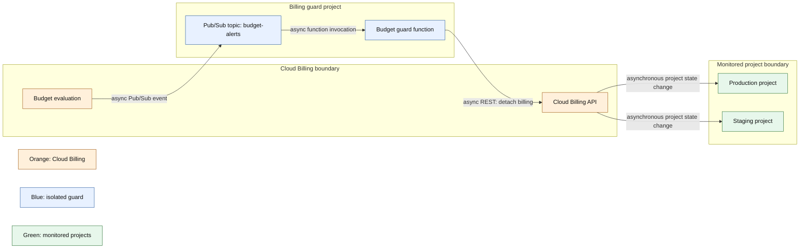

# Billing kill switch

Repository paths in this document refer to the checked-out commit.

## Purpose and boundary

The isolated `billing-guard/` package receives Cloud Billing budget notifications and can detach billing from these monitored projects:

| Project ID                    | Role                   |
| ----------------------------- | ---------------------- |
| `dark-heresy-manager`         | Production application |
| `dark-heresy-manager-staging` | Staging application    |

The guard runs in the separate `dark-heresy-billing-guard` project. It does not detach billing from its own host project.

Detaching a billing account is a cost-containment backstop, not a graceful shutdown. Google Cloud services stop, while Firebase projects are downgraded to the Spark plan and may exceed its quotas. Google warns that some Cloud resources can be removed and become non-recoverable. In-flight work, delayed budget events, and usage posted after the notification can still create cost. A verified backup and a named recovery operator are prerequisites for a live trigger.

## Event and authorization flow



The deployed function's service account requires Project Billing Manager on each monitored project. It does not require Billing Account Administrator.

## Runtime configuration

The values below are environment variables on the deployed billing-guard function, not browser variables and not root `.env` values.

| Variable                  | Required value                                                                                |
| ------------------------- | --------------------------------------------------------------------------------------------- |
| `BILLING_GUARD_BUDGET_ID` | Bare budget ID expected in the Pub/Sub `budgetId` attribute                                   |
| `BILLING_GUARD_DRY_RUN`   | `true` to log actions without calling the Cloud Billing API; unset or `false` for live action |

The topic name `budget-alerts`, region `europe-west2`, monitored project IDs, and runtime service account are defined in `billing-guard/src/index.ts`.

## Live configuration status

The budget amount, billing-account link, topic connection, IAM grants, and deployed environment variables exist outside this repository.

| Check                                     | Status                    |
| ----------------------------------------- | ------------------------- |
| Budget threshold and currency             | Pending live verification |
| Budget-to-topic connection                | Pending live verification |
| Function deployment and runtime variables | Pending live verification |
| Project-level IAM grants                  | Pending live verification |
| End-to-end detach and relink drill        | Pending live verification |

Do not state a monetary threshold or billing-account ID in durable documentation unless it is verified at the time of publication.

## Dry-run verification

A synthetic Pub/Sub event must provide:

| Field | Location | Value |
| --- | --- | --- |
| `budgetId` | Pub/Sub attribute | Configured bare budget ID |
| `costAmount` | JSON message data | Numeric cost in `currencyCode` units |
| `budgetAmount` | JSON message data | Numeric budget in `currencyCode` units |
| `currencyCode` | JSON message data | Currency for both amount fields when supplied |

With `BILLING_GUARD_DRY_RUN=true`, the function must match the budget and log the proposed project actions without calling the Cloud Billing API.

Dry-run success does not prove IAM permission or the detach request.

## Controlled live drill and recovery

1. Confirm the current budget, billing account, IAM bindings, project health, and on-call owner.
2. Ensure no real budget incident is in progress.
3. Set `BILLING_GUARD_DRY_RUN=false` and publish a controlled qualifying event.
4. Verify each project with `gcloud billing projects describe PROJECT_ID`.
5. Relink the approved billing account to each project.
6. Verify billing state and representative application services before closing the drill.

Relink a project with:

```bash
gcloud billing projects link PROJECT_ID --billing-account=BILLING_ACCOUNT_ID
```

Recovery time is `Pending re-measurement`; do not promise an immediate return to service.

## Removal

Disable or remove the budget's Pub/Sub notification, remove the deployed guard function and topic if no longer required, and revoke its project-level IAM grants. Confirm that ordinary email budget alerts remain configured as intended. Deleting the guard project is a separate destructive action and requires an explicit inventory of any other resources it contains.
