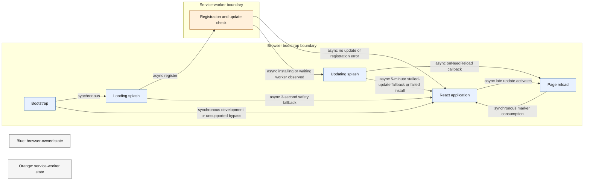

# Startup and PWA update behaviour

Repository paths in this document refer to the checked-out commit.

## Startup state machine

`src/pwaStartup.ts` coordinates rendering before React owns the application shell.



## State contract

| Condition                               | Required result                                                                            |
| --------------------------------------- | ------------------------------------------------------------------------------------------ |
| Development mode                        | Render the application without waiting for a service worker                                |
| Unsupported service worker              | Render the application                                                                     |
| First visit without a controller        | Render after registration callback or safety fallback                                      |
| Controlled visit without an update      | Render the application after the explicit startup check, and keep listening for a late one |
| Update found during startup             | Show the updating splash, mark the session for the reload handoff, and watch the update    |
| Update found after the app has rendered | Keep the application on screen, watch the update, and reload once when it activates        |
| Update activates                        | Request at most one reload                                                                 |
| Update stalls (5 min) or install fails  | Clear the upgrade marker, render the application, and surface a warning after React mounts |
| Registration throws or reports an error | Render the application and record the error path                                           |

The session key `pwa-just-upgraded` prevents a reload from re-entering the same update wait. It is consumed on the next startup.

## Application startup gate

After React owns the shell, `src/components/StartupGate.tsx` decides when the signed-in application opens.

| Condition | Required result |
| --- | --- |
| Active DM campaigns, active member campaigns, archived campaigns and the recovery backup status have all arrived | Open the application |
| Any of those loads is still pending | Keep the logo splash |
| Any of those loads fails, or startup exceeds 30 seconds | Show the startup error modal over the logo splash |
| Sign-in, the device list or the profile fails | Show the startup error modal over the logo splash |
| The application has already opened and a campaign list later fails | Keep the application on screen and show the error in the affected list |

`src/components/StartupErrorModal.tsx` cannot be closed with the backdrop or Escape and offers one Try Again action that reloads the page. The timeout is `STARTUP_LOAD_TIMEOUT_MS` in `src/constants/ui.ts`.

## Static splash

`index.html` contains the same splash as `src/components/SplashScreen.tsx` inside `#root`, so the first paint after any page load, including an update reload, matches the splash. `public/splash-label.js` runs before the application starts and writes "Updating…" into the splash when `pwa-just-upgraded` is present.

## Verification

Use `npm run performance:pwa` for controlled revisions and stalled-asset behaviour.

| Scenario | Required outcome |
| --- | --- |
| First visit | Application renders after registration or the safety fallback |
| Controlled revisit without update | Application renders without a reload |
| Successful activation | Exactly one reload and a consumed post-upgrade marker |
| Update found after the app has rendered | The application stays on screen and reloads once when the update activates |
| Registration failure | Application renders with the error mark |
| Stalled update | Application renders after the stalled-update fallback and warns once |

The production inventory check must also pass:

```bash
npm run build
npm run check:build-inventory
```

Update timing and user-visible recovery baselines are `Pending re-measurement`.
