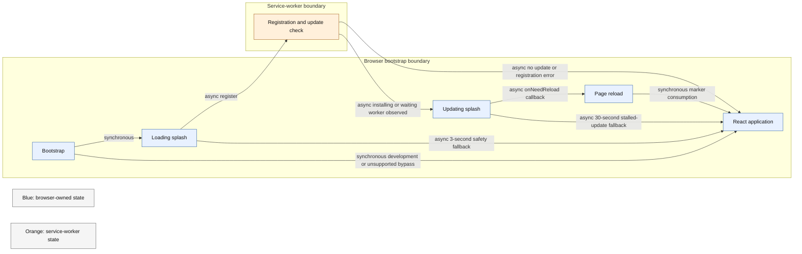

# Startup and PWA update behaviour

Repository paths in this document refer to the checked-out commit.

## Startup state machine

`src/pwaStartup.ts` coordinates rendering before React owns the application shell.



## State contract

| Condition                               | Required result                                                                            |
| --------------------------------------- | ------------------------------------------------------------------------------------------ |
| Development mode                        | Render the application without waiting for a service worker                                |
| Unsupported service worker              | Render the application                                                                     |
| First visit without a controller        | Render after registration callback or safety fallback                                      |
| Controlled visit without an update      | Render after the explicit check                                                            |
| Update found                            | Show the updating splash and mark the session for the reload handoff                       |
| Update activates                        | Request at most one reload                                                                 |
| Update download stalls                  | Clear the upgrade marker, render the application, and surface a warning after React mounts |
| Registration throws or reports an error | Render the application and record the error path                                           |

The session key `pwa-just-upgraded` prevents a reload from re-entering the same update wait. It is consumed on the next startup.

## Verification

Use `npm run performance:pwa` for controlled revisions and stalled-asset behaviour.

| Scenario | Required outcome |
| --- | --- |
| First visit | Application renders after registration or the safety fallback |
| Controlled revisit without update | Application renders without a reload |
| Successful activation | Exactly one reload and a consumed post-upgrade marker |
| Registration failure | Application renders with the error mark |
| Stalled update | Application renders after the stalled-update fallback and warns once |

The production inventory check must also pass:

```bash
npm run build
npm run check:build-inventory
```

Update timing and user-visible recovery baselines are `Pending re-measurement`.
